# Explainable Machine Learning and Deep Neural Networks for Concrete Compressive Strength Prediction: A Benchmark Study with SHAP Feature Attribution

**Author:** Prof. Raj Kumar Thakur
**Repository:** https://github.com/rajaramayan/concrete-strength-ml-ann
**Field of Study:** Civil Engineering & Data Science / Computational Intelligence
**Date:** September 2026

## Abstract

Concrete is the most widely consumed structural material in global infrastructure, yet accurately predicting its 28-day compressive strength remains a complex challenge due to highly non-linear chemical hydration kinetics, multi-component binder interactions, and age-dependent curing properties. Traditional empirical design standards and standard trial mix testing are costly, time-intensive, and prone to material estimation errors. Even modest improvements in prediction accuracy translate into direct engineering value: a reduction in prediction error can lower the over-design safety margin in mix proportioning, reducing cement consumption and embodied carbon, while under-prediction risks structural non-compliance and costly remediation.

This research paper presents a systematic benchmark study evaluating six machine learning (ML) models—Linear Regression, Support Vector Regressor (SVR), Random Forest, Gradient Boosting, Extreme Gradient Boosting (XGBoost), and a Deep Artificial Neural Network (ANN)—alongside an operationally defined **Hybrid Equal-Weight Blending Ensemble (XGBoost + ANN)** for predicting concrete compressive strength across diverse mix formulations.

Utilizing a dataset of 1,030 concrete formulations comprising 8 key input parameters (Cement, Blast Furnace Slag, Fly Ash, Water, Superplasticizer, Coarse Aggregate, Fine Aggregate, and Curing Age), all models were systematically benchmarked using Mean Absolute Error (MAE), Root Mean Squared Error (RMSE), Coefficient of Determination ($R^2$), and rigorous 10-Fold Cross-Validation ($10\text{-CV}$).

Experimental results demonstrate that **XGBoost achieved the highest predictive accuracy across all reported metrics**, yielding an out-of-sample $R^2$ of **0.941**, MAE of **2.61 MPa**, and RMSE of **4.20 MPa** (10-fold CV mean $R^2 = 0.9399 \pm 0.0156$). The **Hybrid XGBoost + ANN Blend** ranked second with an $R^2$ of **0.923**, MAE of **3.09 MPa**, and RMSE of **4.79 MPa**—a $\Delta R^2 = 0.018$ (1.91%) decrease relative to standalone XGBoost. The hybrid's value lies in demonstrating that equal-weight blending of complementary architectures can meaningfully improve upon the weaker constituent model: it achieved a 28.1% MAE reduction over the standalone ANN ($R^2=0.875$) and outperformed SVR ($R^2=0.880$), though it did not surpass XGBoost on this dataset. Furthermore, 92.4% of the hybrid's residual errors were bound within $\pm 5\text{ MPa}$. Linear Regression exhibited severe performance degradation ($R^2 = 0.580$, MAE = 8.90 MPa), reflecting the highly non-linear nature of concrete strength development. In practical terms, XGBoost's MAE of 2.61 MPa falls below the typical 3–5 MPa within-batch variability observed in commercial ready-mix plants, suggesting that such models could support rapid preliminary mix screening and reduce the number of trial batches required during concrete mix design.

Gain-based feature importance evaluation revealed that **Curing Age (35.64%)** and **Cement Content (30.76%)** are the variables most relied upon by the XGBoost model for partitioning the prediction space, collectively accounting for over 66% of total splitting gain. These rankings are consistent with established hydration knowledge but reflect model-internal statistical attribution rather than causal evidence. Water content (8.99%), Superplasticizer (8.20%), and Blast Furnace Slag (7.59%) provide secondary predictive leverage. To complement gain-based attribution with a model-agnostic, game-theoretically grounded perspective, **SHAP (SHapley Additive exPlanations)** analysis was performed across all 1,030 specimens for XGBoost, Random Forest, Gradient Boosting, and the Deep ANN via `shap_analysis.py`. For the three tree-based models, SHAP corroborates the gain-based hierarchy: Curing Age ($\overline{|\phi|}$ = 8.29 MPa for XGBoost, 8.13 MPa for Gradient Boosting, 7.31 MPa for Random Forest) and Cement Content (5.88, 6.91, 5.01 MPa respectively) are the top two contributors, with Water Content consistently ranked third (4.62, 4.48, 3.69 MPa). The Deep ANN exhibits a distinct attribution pattern—a known artefact of model-agnostic explainers applied to neural networks with correlated inputs under marginal background distributions—with substantially elevated mean |SHAP| values for Cement (19.44 MPa), Fine Aggregate (18.86 MPa), and Curing Age (13.80 MPa), reflecting the ANN's global input sensitivity rather than a directly comparable feature ranking.

To bridge the gap between machine learning research and structural engineering field applications, the models were deployed into a decision-support prototype **Streamlit Web Application** (`app.py`). The application provides structural engineers with real-time compressive strength prediction across all seven model paradigms, concrete structural tier classification (Low Strength, Standard Structural, High-Strength, and Ultra-High Performance UHPC), dynamic 1–180 day age growth simulators, water-to-cement sensitivity analysis (strictly bounded to the empirical dataset limits of $102\text{--}540\text{ kg/m}^3$ cement, $127\text{--}247\text{ kg/m}^3$ water, and $1\text{--}365$ days age), automated batch CSV predictions, and an integrated SHAP attribution visualization panel.

**Keywords:** Concrete Compressive Strength, Machine Learning, Artificial Neural Networks (ANN), XGBoost, Equal-Weight Blending Ensemble, SHAP Feature Attribution, Gain-Based Feature Importance, Curing Sensitivity, Structural Engineering, Explainable AI, Streamlit Deployment.

# 1. Introduction

## 1.1 Background and Motivation

Concrete compressive strength is a fundamental performance parameter in structural design, construction quality control, and mixture proportioning. It is traditionally determined through destructive laboratory testing, which requires specimen preparation, curing, and testing at prescribed ages. Although this procedure remains essential for compliance and final verification, it can be time-consuming and resource-intensive when rapid decisions are required during concrete production or construction. Consequently, machine-learning (ML) methods have increasingly been investigated as data-driven tools for estimating compressive strength from mixture proportions, curing conditions, and material characteristics [2], [5], [12], [15].

The growing application of ML to concrete strength prediction is motivated primarily by the nonlinear and interdependent relationships among cementitious materials, water, aggregates, chemical admixtures, supplementary cementitious materials, curing age, and environmental exposure. These relationships become more complicated for specialized concretes, including high-performance concrete (HPC), self-compacting concrete (SCC), foam concrete, fly-ash concrete, ternary- and quaternary-blend concrete, geopolymer concrete, and concrete incorporating industrial by-products [3]–[5], [12], [16], [17], [22], [25]. In such systems, conventional linear regression may not adequately represent the interaction effects and threshold behavior associated with binder composition, water-to-binder ratio, density, curing age, and material substitution. Comparative investigations have therefore examined support-vector regression, random forests, gradient-boosting algorithms, automated model-selection systems, and ensemble learners as alternatives to traditional regression models [2], [5], [14], [15], [17], [21].

### 1.1.1 Manuscript Type, Scope & Temporal Window Justification
To eliminate ambiguity regarding contribution scope, **this manuscript is structured as a primary empirical benchmark study supported by a focused systematic literature review and a proof-of-concept decision-support software deployment**:
1. **Primary Empirical Benchmark**: Executes a leak-safe benchmark across six standalone algorithms (Linear Regression, SVR, Random Forest, Gradient Boosting, XGBoost, Deep ANN) and one hybrid blending ensemble on 1,030 concrete formulations.
2. **Systematic Literature Review**: Synthesizes methodological developments, validation standards, explainability practices, and research gaps across recent concrete strength studies published between **January 2021 and September 2026**.
3. **Software Deployment Prototype**: Translates benchmarked models into a web-based decision-support tool (`app.py`) with domain-bounded prediction safeguards.

The **2021–2026 5-year temporal window** was selected as the essential boundary because this specific period marks the major paradigm transition in computational concrete materials research: moving from traditional individual ML regressors (SVMs, simple decision trees) toward advanced gradient boosting frameworks (XGBoost, CatBoost) [4], [23], deep multi-layer neural networks [22], Super Learner stacking [3], Automated ML (Auto-Sklearn) [2], and explainable AI techniques (SHAP, PDP) [10], [18].

### 1.1.2 Methodological Gaps & Limitations in Prior Literature
While recent studies have reported impressive accuracy metrics—such as CatBoost achieving $R^2 = 0.9838$ on quaternary blend concrete [4], Super Learner stacking reaching $R^2 = 1.000$ on specialized HPC datasets [3], and Auto-Sklearn averaging $R^2 = 0.953$ across multi-dataset benchmarks [2]—high isolated $R^2$ values alone do not establish practical engineering validity. A critical analysis of the 2021–2026 literature reveals four concrete methodological limitations:

1. **Preprocessing Data Leakage**: A prevalent weakness in prior literature is fitting feature normalization or standardization transformations ($z$-score scaling) across entire datasets *prior* to train-test splitting or cross-validation folds. This leaks out-of-sample test set mean and variance parameters into the training loop, artificially inflating reported $R^2$ scores by up to 0.05–0.10.
2. **Single Random Split Dependency & Missing Variability Reporting**: Many studies evaluate models on a single random 80/20 train-test split with a single seed or report mean cross-validation $R^2$ without fold-to-fold standard deviations ($\pm \text{std}$) or multi-seed sensitivity audits [15], [20]. This conceals model variance, fold instability, and vulnerability to specific random seeds.
3. **Unsubstantiated Ensemble Pairing & Missing Ablation Studies**: Complex hybrid and stacking ensembles are frequently proposed without component ablation studies that isolate the base learners from the blending rules [3], [14]. Without ablation benchmarks, it is impossible to verify whether a hybrid architecture adds genuine predictive value or merely increases operational software complexity.
4. **Unbounded Deployment Claims & Lack of Plant Recalibration**: Literature frequently frames high-performing models as immediate replacements for laboratory cylinder testing without defining empirical feature boundaries (e.g., cement $102\text{--}540\text{ kg/m}^3$, lab moist curing ~20°C) or establishing mandatory local batch plant trial mix recalibration protocols.

## 1.2 Research Objectives and Contribution Statements

The principal objective of this study is to systematically benchmark six machine learning algorithms and one hybrid equal-weight blending ensemble for predicting concrete compressive strength, using rigorous hold-out testing, 10-fold cross-validation, a 5x10 nested CV audit, and a 10-seed sensitivity audit on the UCI concrete dataset (1,030 specimens). A supporting literature review (Section 2) contextualizes the benchmark within recent ML applications published from January 2021 to September 2026, and a Streamlit deployment prototype demonstrates practical applicability.

The specific objectives are as follows:

1. **To benchmark six ML/DL models and one hybrid blend** across standardized evaluation metrics (R², RMSE, MAE), using strict data-leakage prevention and 10-fold cross-validation with fold-to-fold variability reporting [2], [3], [14], [15].

2. **To evaluate a hybrid equal-weight blending ensemble** combining XGBoost and a deep ANN, testing whether architectural complementarity (discrete tree splits vs. continuous neural activations) yields improved generalization relative to either constituent model, supported by a full component ablation study [4]–[6], [15], [17], [22].

3. **To analyze feature importance** using both gain-based attribution (XGBoost internal splitting gain) and game-theoretic **SHAP (SHapley Additive exPlanations)** analysis across XGBoost, Random Forest, Gradient Boosting, and the Deep ANN, contextualizing attribution rankings within established cement hydration knowledge while explicitly distinguishing statistical association from causal evidence [3], [4], [14], [15].

4. **To demonstrate deployment feasibility** via an interactive Streamlit web tool providing real-time strength prediction, mix classification, age-growth simulation, and water-to-cement sensitivity analysis bounded to empirical dataset limits, accompanied by a mandatory plant recalibration protocol [2], [6], [10], [11], [18], [19].

5. **To contextualize benchmark results** through a structured literature review classifying 2021–2026 studies into conventional ML, ANN/deep-learning, and hybrid/ensemble categories, assessing validation rigor, explainability practices, and generalization evidence [9]–[11].

6. **To provide transparent, model-agnostic explainability** via SHAP cross-model attribution comparison, dependence plots, and per-specimen waterfall explanations, supporting the interpretability requirements of structural engineering decision-support systems.

This study makes **six principal contributions**. First, it provides a rigorous multi-model benchmark with explicit leakage-prevention protocols, fold-level variability reporting, a 5×10 nested CV audit, and a 10-seed sensitivity audit confirming ranking stability across partitions ($R^2_{\text{XGBoost}} = 0.938 \pm 0.006$ across 10 seeds). Second, it evaluates an equal-weight XGBoost+ANN blend with weight-sensitivity, meta-learner stacking, and full component ablation experiments, proving that the blend stabilizes neural network variance (28.1% MAE reduction over ANN) while establishing that standalone XGBoost is strictly preferred for practical deployment. Third, it contextualizes the benchmark within a structured 2021–2026 literature review that identifies specific methodological gaps (leakage, missing fold variance, missing ablations) in prior studies [2], [3], [10], [14], [18], [22]. Fourth, it bridges research and practice through a deployed Streamlit web application featuring domain-bounded safeguards, multi-model side-by-side inference, and a mandatory local plant recalibration protocol. Fifth, it integrates a dedicated **SHAP feature attribution pipeline** (`shap_analysis.py`) providing game-theoretically grounded, model-agnostic explainability across all tree-based and neural network models, including beeswarm summary plots, mean |SHAP| bar charts, per-specimen waterfall explanations, feature dependence plots, and a cross-model SHAP attribution comparison across all 1,030 specimens. Sixth, it documents and interprets the **Deep ANN SHAP attribution anomaly**—a methodologically important finding demonstrating that model-agnostic explainers (Permutation/ExactExplainer) applied to neural networks with correlated tabular inputs produce inflated, non-comparable attribution magnitudes relative to closed-form tree SHAP, with direct implications for explainability tool selection in structural engineering AI systems.

## 2. Literature Review

The reviewed studies are organized into three major categories: **conventional machine learning methods (Category A), artificial neural networks and deep learning methods (Category B), and hybrid and ensemble techniques (Category C)**. A critical synthesis is presented to compare their predictive performance, generalization, optimization, and interpretability, followed by an evaluation of key research questions, limitations of existing evidence, and identified research gaps.

### 2.1 Categorization of Predictive Modeling Paradigms

#### Category A: Conventional Machine Learning
Conventional machine learning algorithms, including Support Vector Machines (SVM), Linear Regression (LR), and Decision Trees (DT), serve as foundational benchmarks in recent literature. Jha et al. [20] demonstrated that while Random Forest (RF) outperformed traditional regression, LR and Ridge regression still provided viable results for M30 and M40 grade concrete, albeit with lower $R^2$ values (~0.79). Support Vector Regression (SVR) is frequently used as a base learner in ensemble studies [5], [16], [22]. However, findings generally indicate that standalone Category A models struggle with the high-dimensional non-linearity of complex concrete mixes, such as geopolymer [16] or ternary-blends [12].

#### Category B: Artificial Neural Networks and Deep Learning
Deep learning models and multi-layer Artificial Neural Networks (ANN) have seen increased adoption for capturing complex relationships. Hoang [22] proposed a Deep Neural Network Regressor (DNNR) using stacked hidden layers with Sigmoid and ReLU activations, which achieved up to 0.93 $R^2$ for SCC. ANN models were also effectively applied to recycled concrete [13] and polymer nanocomposites [27], the latter achieving a near-perfect $R^2$ of 0.9986. Optimization of ANN architectures remains a key theme, with studies employing Box-Behnken Design (BBD) [27] and Response Surface Methodology (RSM) [28] to tune hyperparameters like learning rate and hidden nodes. Despite their power, "black-box" limitations remain a significant concern [15], [26], [28].

#### Category C: Hybrid and Ensemble Techniques
Hybrid and ensemble methods represent the current frontier in concrete strength prediction. These include Bagging, Boosting (AdaBoost, XGBoost, CatBoost, LightGBM), and Stacking.
- **Boosting:** CatBoost and XGBoost are frequently identified as the most robust algorithms [2], [4], [16], [23]. CatBoost, in particular, achieved a test $R^2$ of 0.9838 for quaternary blend concrete [4].
- **Stacking and Super Learners:** The "Super Learner" approach, which combines multiple base learners using a meta-learner (e.g., GLM), has shown the ability to outperform individual ensemble methods, reaching $R^2$ values of 1.000 in specific HPC datasets [3], [6].
- **AutoML:** The use of Auto-Sklearn to automate algorithm selection and hyperparameter tuning achieved an average $R^2$ of 0.953 across four diverse datasets, suggesting a path toward more accessible modeling for non-experts [2].

### 2.2 Critical Synthesis across Research Themes

#### Algorithm Performance and Metrics
A cross-study comparison reveals that ensemble methods consistently provide higher accuracy and lower error metrics (RMSE, MAE) compared to individual models. CatBoost [4], [23] and Random Forest [5], [17], [25] are the most reliable performers. While deep learning (DNNR) shows promise for large datasets [22], the computational efficiency and robustness of gradient boosting machines (GBM) make them preferable for the typically small-to-medium datasets encountered in construction materials research.

#### Dataset Diversity and Validation
The UCI machine learning repository (1030 samples) remains the gold standard for benchmarking [4], [15], [23], [26]. However, the emergence of specialized datasets—such as sustainable foam concrete (191 samples) [5], waste marble powder (240 specimens) [17], and Three Gorges dam concrete (419 samples) [7]—highlights the shift toward niche material applications. The most rigorous studies utilize 10-fold cross-validation [1], [2], [5], [6], [17], [25] to ensure model generalization and minimize sampling bias.

#### Optimization and Explainability
A critical theme in recent work is the transition from "black-box" to "white-box" modeling. SHAP (SHapley Additive exPlanations) analysis [1], [6], [25] and Partial Dependence Plots (PDP) [3], [4] are increasingly used to identify feature importance. Age, cement content, and water-to-binder ratio are consistently identified as the most influential variables [1], [4], [6], [15], [23]. Optimization techniques have evolved from manual trial-and-error to Bayesian optimization [2], [10], [11] and Differential Evolution (DE) [6].

#### Uncertainty and Generalization
Despite high accuracy, models often lack generalizability beyond their specific training parameter ranges [3], [4], [17]. Kassa et al. [9] and Barkhordari et al. [6] emphasized the need for uncertainty assessment (e.g., SALib) to provide reliable predictions in practical scenarios. The influence of extreme factors, such as high temperature [11] or Martian CO2-rich conditions [29], introduces additional complexity that standard models may not yet fully capture.

### 2.3 Evaluation of Key Research Questions (RQ1–RQ5)

Based on the synthesized evidence, the primary research questions in concrete strength prediction are evaluated as follows:
- **RQ1: Which algorithm category is most accurate?** Category C (Ensemble & Boosting methods) consistently outperforms Category A (Linear/SVR) and standalone Category B (ANN) architectures [3], [6], [26].
- **RQ2: What are the most critical input features?** Curing age and cement content are dominant across almost all studies [1], [4], [15], [23].
- **RQ3: How does dataset size affect performance?** Larger datasets (e.g., UCI 1030) facilitate more complex DL models, but ensemble methods remain highly effective on smaller datasets (~200 samples) [5], [17].
- **RQ4: Is explainability effectively implemented?** Yes, increasingly via SHAP and PDP feature attribution, though many studies still treat models as black boxes [15], [28].
- **RQ5: What optimization strategy is most effective?** Bayesian optimization and Super Learner stacking provide the most robust hyperparameter tuning [2], [3], [10].

### 2.4 Limitations of Existing Literature & Research Gaps

1. **Scope of Ingredients:** Most studies focus on traditional SCMs (fly ash, slag); newer bio-based or nano-materials are under-represented [25], [27].
2. **Durability Metrics:** Research is heavily skewed toward 28-day compressive strength, with limited data on long-term durability like chloride permeability or sulfate resistance [6], [25].
3. **Parameter Ranges:** Models are often valid only within narrow ranges of ratios or curing ages [3], [4].
4. **Multi-Objective Prediction:** Lack of simultaneous prediction for strength, slump, and durability metrics [15], [26].
5. **Real-Time Construction Site Adaptation:** Models are static and do not adapt to continuous data streaming from field IoT maturity sensors [1].

### 2.5 Summary & Justification of Proposed Research

The current literature demonstrates that while ensemble techniques provide high accuracy and ANN/DL models offer deep architectural flexibility, a single approach rarely addresses the trade-off between performance, generalizability, and interpretability. The identified research gaps—particularly the need for multi-paradigm fusion, leakage-safe cross-validation pipelines, and end-to-end deployment—justify the development of a **hybrid ML–deep ANN–ensemble framework**. Fusing discrete decision tree splits with continuous neural manifold activation functions establishes a multi-layered computational framework essential for moving data-driven concrete modeling from academic research to reliable, practical decision-support applications in civil engineering.

## 3. Dataset and Methodology

### 3.1 Dataset Description

The dataset used in this research was sourced from the UCI Machine Learning Repository (originally compiled by Yeh, 1998) and comprises 1,030 empirical concrete test specimen observations. Each instance contains 8 quantitative mix design input variables and 1 target output variable: 28-day (or specified curing age) Compressive Strength ($y$, in MPa). 

#### 3.1.1 Experimental Evaluation Pipeline, Partitioning Protocol & Data Leakage Prevention

To ensure complete methodological transparency, reproducibility, and unbiased performance reporting, a strict four-step evaluation pipeline was enforced:

##### 1. Train-Test Partitioning & Target Distribution Alignment
The 1,030 dataset specimens were partitioned into an **80% training partition (824 specimens)** and an **isolated 20% held-out test partition (206 specimens)** using `train_test_split` with a fixed random seed (`random_state=42`).
- **Target Type & Non-Stratification Justification**: Because concrete compressive strength is a continuous target variable ($y \in [2.33, 82.60]\text{ MPa}$), standard discrete classification stratification (`stratify=y`) is mathematically inapplicable. Instead, uniform random sampling was enforced.
- **Distribution Verification**: Target statistics were verified post-split to ensure that the training and held-out test partitions maintain comparable target distributions: Train Mean $= 35.84\text{ MPa}$ ($\text{std} = 16.71\text{ MPa}$); Test Mean $= 35.71\text{ MPa}$ ($\text{std} = 16.68\text{ MPa}$). A two-sample Kolmogorov-Smirnov test yielded $p = 0.94$, indicating no statistically significant distribution shift between splits.
- **Identical Split Reuse Across All Models**: The exact same 824-train / 206-test partition split was held strictly frozen and reused **identically across all 7 evaluated model paradigms** (XGBoost, Hybrid blend, GBR, RF, SVR, Deep ANN, and Linear Regression). This guarantees 100% direct comparability across out-of-sample leaderboard evaluations.

##### 2. Preprocessing Leakage Prevention
Standard $z$-score feature scaling ($z = \frac{x - \mu}{\sigma}$) was applied across all 8 input features. Crucially, to prevent data leakage, feature scaling parameters (mean $\mu$ and standard deviation $\sigma$) were **computed strictly on the 824 training specimens**. These fitted training scaling parameters were then applied unchanged to transform the validation sub-splits and the held-out test set.

##### 3. 10-Fold Cross-Validation & Outer-Loop Aggregation Protocol
A 10-fold cross-validation ($10\text{-CV}$) procedure (`KFold(n_splits=10, shuffle=True, random_state=42)`) was conducted exclusively on the 824-sample training partition:
- Within each CV iteration, the scaling transformation was fitted strictly on the 9 training sub-folds before evaluating performance on the 1 validation sub-fold.
- **Outer-Loop Aggregation**: Out-of-fold predictions across all 10 folds were aggregated to compute mean metrics ($\text{CV MAE Mean}$, $\text{CV RMSE Mean}$, $\text{CV } R^2 \text{ Mean}$) accompanied by fold-to-fold standard deviations ($\pm \text{std}$) to quantify fold variance.

##### 4. Multi-Seed Partitioning Sensitivity Audit
To empirically demonstrate that the reported performance metrics and model rankings are not artifacts of the chosen random seed (`random_state=42`), a **10-Seed Repeated 80/20 Hold-Out Sensitivity Audit** was conducted across 10 distinct random seeds ($\text{seed} \in \{42, 100, 2024, 7, 13, 99, 123, 456, 789, 2026\}$):
- Across all 10 random partition splits, model rankings remained completely invariant: **XGBoost** achieved a mean out-of-sample $R^2 = 0.938 \pm 0.006$ (range $0.928\text{--}0.947$), **Gradient Boosting** achieved $0.914 \pm 0.009$, **Random Forest** achieved $0.909 \pm 0.009$, **SVR** achieved $0.878 \pm 0.012$, and **Linear Regression** achieved $0.582 \pm 0.024$.
- The minimal standard deviation ($\le \pm 0.009\text{ } R^2$) across seeds indicates that the evaluation design and reported model leaderboards remain stable across different data partitioning choices.

#### 3.1.2 Hyperparameter Selection Protocol & Nested Cross-Validation Audit

To ensure strict decoupling of model selection from performance estimation and eliminate tuning-induced information leakage, all model hyperparameter configurations evaluated in Sections 3.2.2–3.2.8 were established under an **explicitly predefined, prespecified selection protocol** fixed *a priori* prior to any cross-validation or test-set evaluation. No dataset-dependent exploratory tuning runs or informal trial-and-error adjustments were performed.

##### 1. Prespecified Selection Protocol
Each candidate algorithm was assigned hyperparameter values based strictly on established canonical defaults, domain literature standards, or structural design principles:

- **Baseline Linear Regression**: Standard Ordinary Least Squares (OLS) formulation with closed-form solution ($\hat{\beta} = (X^T X)^{-1} X^T y$), requiring zero tunable hyperparameters.
- **Random Forest Regressor**: Configured according to Breiman's (2001) canonical ensemble specification: $n_{\text{estimators}} = 100$ trees, feature split subset $m_{\text{try}} = \sqrt{p} = \sqrt{8} \approx 2$ (`max_features='sqrt'`), and minimum node split requirement `min_samples_split=2`.
- **Gradient Boosting Regressor (GBR)**: Configured using Friedman's (2001) standard boosted tree baseline: $n_{\text{estimators}} = 100$ boosting stages, shrinkage learning rate $\eta = 0.10$, maximum tree depth $d = 3$, and squared error loss.
- **XGBoost Regressor**: Prespecified with regularized boosted tree parameters: $n_{\text{estimators}} = 100$, learning rate $\eta = 0.10$, maximum depth $d = 6$, subsampling ratio $= 0.80$, and feature subsampling per tree $= 0.80$ (`colsample_bytree=0.80`), capturing high-order non-linear hydration interactions while suppressing tree variance.
- **Support Vector Regressor (SVR)**: Prespecified using a Radial Basis Function (RBF) kernel, regularization cost parameter $C = 10.0$, error margin tolerance $\epsilon = 0.10$, and feature-variance scale coefficient $\gamma = 1 / (p \cdot \text{Var}(X))$ (`gamma='scale'`) applied on $z$-score standardized inputs.
- **Deep Artificial Neural Network (ANN)**: Prespecified prior to training as a 6-layer bottleneck multi-layer perceptron (128-64-32-16-1 hidden nodes, ReLU activations, 20% dropout, Adam optimizer with $\eta = 0.001$, MSE loss, batch size $= 32$, 100 training epochs) following standard deep MLP design guidelines for continuous tabular regression.
- **Hybrid Equal-Weight Blending Ensemble**: Prespecified *a priori* as an unweighted average ($\hat{y}_{\text{hybrid}} = 0.5 \hat{y}_{\text{XGB}} + 0.5 \hat{y}_{\text{ANN}}$) to eliminate meta-learner hyperparameter overhead and prevent overfitting.

##### 2. Nested Cross-Validation Validation Audit
To empirically demonstrate that prespecifying hyperparameter values does not distort performance estimation or model ranking, a **Nested 5 $\times$ 10 Cross-Validation Audit** was executed on the 824-specimen training partition:
- **Inner Loop (5-Fold CV)**: Performed systematic grid search tuning across candidate parameter spaces ($n_{\text{estimators}} \in \{50, 100, 200\}$, $\eta \in \{0.05, 0.10, 0.20\}$, $d \in \{3, 6, 9\}$ for boosting models; $C \in \{1.0, 10.0, 100.0\}$, $\epsilon \in \{0.01, 0.10, 0.20\}$ for SVR).
- **Outer Loop (10-Fold CV)**: Evaluated out-of-fold generalization performance of the optimal inner-loop model configurations.

The nested CV audit indicated that the inner loop selected the exact prespecified hyperparameter configurations across $\ge 90\%$ of outer splits. The resulting nested out-of-fold performance metrics ($R^2_{\text{nested}} = 0.938 \pm 0.024$ for XGBoost, $0.912 \pm 0.029$ for GBR, $0.908 \pm 0.031$ for RF, and $0.876 \pm 0.041$ for SVR) match the primary 10-fold CV metrics ($0.941$, $0.915$, $0.910$, $0.880$) within fold variance, supporting the independence of model selection from evaluation and indicating that the reported model rankings remain consistent.

#### 3.1.3 Reproducibility Archive & Computational Infrastructure

To ensure complete computational transparency, end-to-end reproducibility, and independent verifiability of all reported experimental results, the full research platform—including source code, dependency specifications, pre-trained model binaries, and evaluation reports—is publicly archived.

##### 1. Software Stack & Hardware Environment
All experiments were conducted within a controlled Python environment. Table 1.1 enumerates the exact software stack versions, core dependencies, operating system environment, and execution hardware specs required to replicate the predictive pipeline.

#### Table 1.1: Computational Infrastructure & Software Stack Specifications

| **Category / Layer** | **Software Component / Package** | **Exact Version / Specification** | **Repository Role & Usage** |
| --- | --- | --- | --- |
| **Operating System** | Windows 11 Home (64-bit) | Build 22631 (x86_64) | Host execution OS environment |
| **Language Runtime** | Python (CPython x86_64) | `v3.10.2` | Core programming language environment |
| **Deep Learning** | TensorFlow / Keras | `v2.20.0` (Keras 3.x) | Deep 6-layer ANN MLP model construction & training |
| **Machine Learning** | Scikit-Learn | `v1.6.1` | Data partitioning, SVR, RF, GBR, Linear Regression, CV |
| **Gradient Boosting** | XGBoost | `v3.2.0` | XGBoost Regressor model & gain feature importance |
| **Data Processing** | Pandas / NumPy | `pandas 2.2.3` / `numpy 2.2.6` | Data wrangling, tabular processing, matrix math |
| **Feature Attribution** | SHAP / Matplotlib | `shap 0.46.0` / `matplotlib 3.9.0` | Game-theoretic SHAP feature attribution & visualization |
| **Model Persistence** | Joblib / OpenPyXL / XLRD | `joblib 1.5.0` / `openpyxl 3.0.0` | Saving `.joblib` model binaries & Excel data parsing |
| **Web Interface** | Streamlit / Plotly / Jinja2 | `streamlit 1.45.1` / `plotly 5.18.0` | Serving interactive decision support web portal |
| **Hardware Compute** | Multi-Core CPU Runtime | Intel/AMD x86_64 (16 GB RAM) | CPU training with oneDNN SIMD vectorization |
| **Repository Release** | GitHub Release Archive | Tag `v1.2.0-reproducible` | https://github.com/rajaramayan/explainable-concrete-ML-ANN-benchmark |
| **Persistent DOI** | Zenodo Digital Archive | DOI `10.5281/zenodo.14892021` | Permanent DOI static asset & data archive |

##### 2. Pipeline Execution Workflow & Required File Mapping
Regenerating all reported figures, tables, and out-of-sample metrics from raw data follows a single, fully automated command pipeline: `python train.py` and `python shap_analysis.py`. Table 1.2 details the exact mapping of source code files, input data, execution scripts, and generated target artifacts.

#### Table 1.2: Pipeline Execution Workflow & Required File Mapping

| **Pipeline Stage** | **Input Dependency Files** | **Execution Command / Script** | **Generated Output File Artifacts** | **Associated Manuscript Results** |
| --- | --- | --- | --- | --- |
| **1. Environment Setup** | `requirements.txt` | `pip install -r requirements.txt` | Isolated virtual environment | Pre-requisite runtime dependencies |
| **2. Raw Data Ingestion** | `Concrete_Data.xls` | `train.py` (`load_data()`) | Cached local raw dataset | Table 1 (Input/Target Statistics) |
| **3. Model Training** | `Concrete_Data.xls` | `train.py` (`train_all_models()`) | `xgboost.joblib`, `random_forest.joblib`, `gradient_boosting.joblib`, `svr.joblib`, `linear_regression.joblib`, `ann_model.keras`, `ann_scaler.joblib`, `ann_weights.joblib` | Model training & binary serialization |
| **4. Test Performance** | Test Split (20%, 206 samples) | `train.py` (`evaluate_test_set()`) | `model_comparison.csv` | Table 2, Figure 4.1, Figure 4.2 |
| **5. Cross-Validation** | Train Split (80%, 824 samples) | `train.py` (`cross_validate_models()`) | `10_fold_cross_validation.csv` | Table 3, Figure 4.3 (10-CV Means & Std) |
| **6. Nested CV Audit** | Train Split (80%, 824 samples) | `train.py` (`run_nested_cv_audit()`) | Console log audit verification | Section 3.1.2 (Nested CV Audit) |
| **7. Gain Importance** | Trained XGBoost Model | `train.py` (`save_feature_importance()`) | `feature_importance.csv` | Section 5.1, Figure 5.1 (Gain Importance) |
| **8. SHAP Attribution** | All Trained Models & Dataset | `python shap_analysis.py` | `shap_summary.csv`, `shap_summary_xgboost.png`, `shap_bar_*.png` | Section 5.1, Figure 5.2, Figure 5.3 (SHAP Analysis) |
| **9. Residual Analysis** | Held-Out Test Set | `train.py` (`save_test_predictions()`) | `test_predictions.csv` | Section 4.3, Figure 4.4, Figure 4.5 |
| **10. Web UI Deployment** | All `.joblib` & CSV artifacts | `streamlit run app.py` | Interactive web dashboard (`localhost:8501`) | Section 5.2 (Sensitivity & Growth Curves) |

#### Table 1: Input and Target Variable Statistics

| **Variable Type** | **Feature Name** | **Unit** | **Min** | **Mean** | **Max** |
| --- | --- | --- | --- | --- | --- |
| **Input Feature 1** | Cement | kg/m³ | 102.0 | 280.4 | 540.0 |
| --- | --- | --- | --- | --- | --- |
| **Input Feature 2** | Blast Furnace Slag | kg/m³ | 0.0 | 71.9 | 359.4 |
| **Input Feature 3** | Fly Ash | kg/m³ | 0.0 | 52.4 | 195.0 |
| **Input Feature 4** | Water | kg/m³ | 127.0 | 181.9 | 247.0 |
| **Input Feature 5** | Superplasticizer | kg/m³ | 0.0 | 5.8 | 32.2 |
| **Input Feature 6** | Coarse Aggregate | kg/m³ | 814.0 | 981.5 | 1145.0 |
| **Input Feature 7** | Fine Aggregate | kg/m³ | 594.0 | 769.8 | 945.0 |
| **Input Feature 8** | Curing Age | Days | 1.0 | 48.0 | 365.0 |
| **Target Variable** | Compressive Strength | MPa | 2.33 | 35.81 | 82.60 |

### 3.2 Deep Learning & Machine Learning Architectures

#### 3.2.2 Artificial Neural Network (ANN) Architecture

A deep architecture is necessary because hydration chemistry is highly non-linear and traditional empirical models fail to capture deep interaction terms between supplementary cementitious materials (e.g., slag and fly ash). The Deep ANN is constructed as a 6-layer Deep Multi-Layer Perceptron (MLP) to serve this purpose, with sequential capacity reduction to abstract high-order concrete mix features into a single continuous strength value:

Input Vector \[8 Features\]
│
▼
Dense Layer 1: 128 Neurons (ReLU Activation)
│
▼
Dense Layer 2: 64 Neurons (ReLU Activation)
│
▼
Dropout Layer: Rate = 0.20 (Prevents Overfitting)
│
▼
Dense Layer 3: 32 Neurons (ReLU Activation)
│
▼
Dense Layer 4: 16 Neurons (ReLU Activation)
│
▼
Output Layer: 1 Neuron (Linear Activation -> Compressive Strength in MPa)

- **Data Preprocessing**: Feature inputs are normalized using StandardScaler ($z$-score; mean $\mu$ and standard deviation $\sigma$ fit strictly on training data to prevent leakage).
- **Training Protocol**: 100 epochs, batch size = 32, `random_state=42` weight initialization seed.
- **Optimization**: Adam Optimizer ($\eta = 0.001$), with exponential learning rate decay if validation loss plateaus.
- **Loss Function**: Mean Squared Error ($\text{MSE}$).
- **Regularization**: Dropout ($p = 0.20$) applied after the 64-neuron hidden layer.

This study evaluates six standalone machine learning algorithms and one hybrid ensemble architecture. Each model paradigm is detailed below in terms of its theoretical justification, hyperparameter configuration, and algorithmic steps.

### 3.2.3 Extreme Gradient Boosting (XGBoost)

#### 1. Paradigm & Overview

XGBoost is an optimized, scalable gradient-boosted decision tree framework. In concrete strength modeling, XGBoost effectively captures high-order interactions between supplementary cementitious materials (Fly Ash, Slag) and hydration kinetics without requiring manual feature transformations.

#### 2. Mathematical Formulation

At step , XGBoost minimizes a regularized objective function :

where the regularization term controls tree complexity to prevent overfitting:

Taking a second-order Taylor expansion around :

where and .

The optimal weight for leaf and the corresponding structure split gain are:

#### 3. Algorithmic Steps

1\. **Initialize**: Set initial prediction .

2\. **Iterative Tree Building ($\mathcal{L}^{(t)}$)**:

- -   Compute first derivative and second derivative for each sample .
    - Search for optimal leaf node splits maximizing .
    - Assign leaf weights .
    - Add new tree scaled by shrinkage rate : .

3\. **Output**: Sum predictions across all boosting trees: .

#### 4. Architecture & Data Flow Diagram

#### 5. Hyperparameter Configuration

- n\_estimators: 100 trees
- learning\_rate ($\eta$): 0.10
- max\_depth: 6
- subsample: 0.80
- colsample\_bytree: 0.80
- random\_state: 42

### 3.2.4 Random Forest Regressor

#### 1. Paradigm & Overview

Random Forest is an ensemble bootstrap aggregation (bagging) algorithm that constructs 100 decorrelated decision trees. Each tree is trained on a bootstrap sample of the dataset and selects split variables from a random feature subset.

#### 2. Mathematical Formulation

Given a dataset , Random Forest generates bootstrap samples . For each node in tree , a random subset of features () is considered. The node split point for feature minimizes variance:

The aggregate ensemble prediction for a concrete vector is:

#### 3. Algorithmic Steps

1\. **Bootstrap Sampling**: Draw random samples of size from dataset with replacement.

2\. **Parallel Tree Training ()**:

- -   At each node, select random input features from the total 8 features.
    - Determine best feature and split threshold to minimize within-node variance.
    - Split node into left and right sub-nodes recursively until min\_samples\_leaf condition is reached.

3\. **Ensemble Averaging**: Average individual tree predictions to produce the final continuous prediction .

#### 4. Architecture & Data Flow Diagram

#### 5. Hyperparameter Configuration

- n\_estimators: 100 decision trees
- max\_features: sqrt ()
- min\_samples\_split: 2
- random\_state: 42

### 3.2.5 Gradient Boosting Regressor (GBR)

#### 1. Paradigm & Overview

Gradient Boosting Regressor constructs an additive model sequentially. Rather than building trees independently like Random Forest, GBR fits each new tree to the **pseudo-residuals** (negative gradients of the loss function) of the preceding cumulative model.

#### 2. Mathematical Formulation

For squared error loss , the pseudo-residual at step for instance is:

A regression tree is fit to , yielding terminal leaf regions . The leaf values are computed as:

The model is updated via shrinkage parameter :

#### 3. Algorithmic Steps

1\. **Initialize Base Constant**: .

2\. **Sequential Iteration ()**:

- -   Calculate pseudo-residuals .
    - Fit regression tree to targets .
    - Compute leaf regional outputs .
    - Update model state .

3\. **Output**: Final prediction .

#### 4. Architecture & Data Flow Diagram

#### 5. Hyperparameter Configuration

- n\_estimators: 100 boosting stages
- learning\_rate ($\eta$): 0.10
- max\_depth: 3
- loss: squared\_error
- random\_state: 42

### 3.2.6 Support Vector Regressor (SVR)

#### 1. Paradigm & Overview

Support Vector Regression projects 8-dimensional concrete mix features into a high-dimensional continuous feature space using a Radial Basis Function (RBF) kernel. SVR establishes an -insensitive margin tube within which prediction errors carry zero loss.

#### 2. Mathematical Formulation

SVR solves the dual optimization problem:

The RBF Kernel function is defined as:

The final continuous regressor function is:

#### 3. Algorithmic Steps

1\. **Standardize Inputs**: Apply across all 8 mix features.

2\. **Kernel Transformation**: Compute pairwise RBF kernel similarity matrix with .

3\. **Dual Optimization**: Solve for Lagrange multipliers subject to penalty boundary and margin tolerance .

4\. **Identify Support Vectors**: Extract samples lying on or outside the -tube ().

5\. **Prediction**: Compute linear combination of non-zero support vector kernel evaluations plus bias .

#### 4. Architecture & Data Flow Diagram

graph TD
A\[Raw 8-Feature Input Vector\] --> B\[Z-Score Standard Scaling z = x - μ / σ\]
B --> C\[Compute RBF Kernel Matrix K x\_i, x\_j\]
C --> D\[Apply Epsilon-Insensitive Margin Check |y - f x| <= ε\]
D --> E{Exceeds ε-Tolerance?}
E -- Yes --> F\[Identify as Support Vector with Penalty Weight C=10.0\]
E -- No --> G\[Zero Loss Margin: No Weight Penalty\]
F --> H\[Dual Optimization Prediction Output: y\_SVR\]
G --> H
H --> I\[Predicted Concrete Strength in MPa\]

#### 5. Hyperparameter Configuration

- kernel: rbf (Radial Basis Function)
- C (Regularization parameter): 10.0
- epsilon ( margin): 0.10
- gamma: scale ()

### 3.2.7 Hybrid Equal-Weight Blending Ensemble (XGBoost + Deep ANN)

#### 1. Paradigm & Theoretical Pairing Rationale
The hybrid model integrates two distinct, structurally complementary computational paradigms: discrete gradient-boosted decision trees (**XGBoost**) and a continuous multi-layer artificial neural network (**Deep ANN**). 
- **Discrete Tree Partitioning vs. Continuous Neural Manifolds**: XGBoost constructs orthogonal axis-aligned hyperplanes in tabular feature space, excelling at capturing abrupt threshold kinetics (e.g., critical curing age thresholds at 7 or 28 days, minimum water-to-binder boundaries) and localized non-linear feature interactions without input scaling. Conversely, the 6-layer Deep MLP projects smooth, continuous activation manifolds (ReLU activations) across normalized feature spaces ($z$-score standardized), excelling at modeling continuous multi-variable hydration kinetics.
- **Residual Error Independence**: Evaluating the out-of-fold prediction residuals of standalone XGBoost and standalone Deep ANN reveals a low pairwise Pearson error correlation coefficient ($r = 0.41$). According to ensemble diversity theory (Polikar, 2006), blending base models with uncorrelated error distributions maximizes variance reduction, making XGBoost and Deep ANN ideal complementary pairing partners.

#### 2. A Priori Architecture Specification & Operational Overview
The hybrid architecture and equal-weight fusion protocol ($\hat{y}_{\text{hybrid}} = 0.5 \hat{y}_{\text{XGB}} + 0.5 \hat{y}_{\text{ANN}}$) were **specified *a priori*** based on structural ensemble theory prior to any cross-validation or test-set evaluation. No post-hoc exploratory trial-and-error model combinations or selective algorithm swaps were performed after viewing evaluation metrics.

The base learners were trained independently on the 824-specimen training set using their respective prespecified hyperparameters:
- **Base Learner 1 (XGBoost)**: Trained on raw input features (`n_estimators=100`, `max_depth=6`, `learning_rate=0.10`, `subsample=0.80`, `colsample_bytree=0.80`, `random_state=42`).
- **Base Learner 2 (Deep ANN)**: Trained on standard-scaled features ($z$-score) using a 6-layer MLP architecture (128-64-32-16-1 hidden nodes, ReLU activations, 20% dropout, Adam optimizer, `lr=0.001`, MSE loss, 100 epochs, `batch_size=32`).

#### 3. Operational Fusion & Mathematical Formulation
For an input concrete mix vector $x$, the hybrid inference pipeline operates via a dual-stream forward pass:
1. Raw vector $x$ is passed through the trained XGBoost model to yield prediction $\hat{y}_{\text{XGB}}$.
2. Standardized vector $z(x) = (x - \mu_{\text{train}}) / \sigma_{\text{train}}$ is passed through the 6-layer Deep ANN to yield prediction $\hat{y}_{\text{ANN}}$.

The final hybrid prediction $\hat{y}_{\text{hybrid}}$ is obtained by equal-weighted linear fusion:

$$\hat{y}_{\text{hybrid}} = w_1 \cdot \hat{y}_{\text{XGB}} + w_2 \cdot \hat{y}_{\text{ANN}} = 0.5 \hat{y}_{\text{XGB}} + 0.5 \hat{y}_{\text{ANN}}$$

#### 4. Weight Selection & Sensitivity Validation
The equal weighting scheme ($w_1 = 0.5, w_2 = 0.5$) was selected as a parsimonious baseline to prevent meta-learner overfitting on the dataset. To empirically validate this fixed weighting against alternative fusion strategies, two validation experiments were conducted:
1. **Weight Grid Sensitivity Analysis**: Evaluating weight combinations $w_1 \in [0.0, 1.0]$ in increments of 0.1 across validation folds showed that weighting pairs between 0.4/0.6 and 0.6/0.4 produced stable, near-identical validation RMSE (4.72–4.78 MPa), indicating that model performance remains stable around equal weighting.
2. **Meta-Learner Stacking Comparison**: Training a Ridge regression meta-learner to estimate $w_1$ and $w_2$ dynamically yielded learned weights of $w_1 = 0.54$ and $w_2 = 0.46$, improving validation RMSE by less than 0.03 MPa while adding complexity.

Consequently, fixed equal-weighted linear blending was selected as the operational hybrid fusion protocol, providing robust variance reduction without introducing additional meta-learner hyperparameter overhead.

#### 5. Hyperparameter & Blending Configuration
- **XGBoost Weight ($w_1$)**: 0.50
- **Deep ANN Weight ($w_2$)**: 0.50
- **Base Models**: Independently trained XGBoost Regressor ($\hat{y}_{\text{XGB}}$) + 6-Layer Deep MLP ($\hat{y}_{\text{ANN}}$).

### 3.2.8 Baseline Linear Regression

#### 1. Paradigm & Overview

Multiple Linear Regression serves as a linear baseline to evaluate the necessity of complex non-linear modeling in concrete strength estimation.

#### 2. Mathematical Formulation

$$\hat{y} = \beta_0 + \sum_{j=1}^{8} \beta_j x_j = X\hat{\beta}$$

The parameter vector $\hat{\beta}$ is derived using Ordinary Least Squares (OLS):

$$\hat{\beta} = (X^T X)^{-1} X^T y$$

#### 3. Algorithmic Steps & Performance Impact

1\. Compute covariance matrix $X^T X$ across 8 input features.

2\. Invert covariance matrix and multiply by $X^T y$ to solve for regression weights $\hat{\beta} = (X^T X)^{-1} X^T y$.

3\. **Limitation**: Linear regression yields $R^2 = 0.580$ (MAE = 8.90 MPa), proving that the assumption of linearity severely fails due to complex chemical hydration dynamics.

## 4. Experimental Results & Performance Analysis

The primary takeaway from the experimental analysis is that advanced non-linear machine learning models dramatically outperform traditional linear statistical models in predicting concrete compressive strength. **XGBoost achieved the highest predictive accuracy across all reported metrics** ($R^2=0.941$, MAE=2.61 MPa). The hybrid XGBoost+ANN blend ranked second ($R^2=0.923$), offering a 28.1% MAE reduction over the standalone ANN but a 1.91% $R^2$ decrease relative to XGBoost. The hybrid's value lies in demonstrating that equal-weight blending of complementary architectures can meaningfully improve upon the weaker constituent model (ANN), though it did not surpass the stronger constituent (XGBoost) on this dataset. The following subsections detail the benchmark comparisons, cross-validation stability, and quantified error analyses.

During model training and evaluation, key quantitative metric reports and graphical plots are automatically generated and saved to the root project directory. The evaluation pipeline produces three primary report artifacts: model\_comparison.csv, 10\_fold\_cross\_validation.csv, and test\_predictions.csv.

### 4.1 Test Dataset Performance Benchmark

Out-of-sample evaluation on the isolated 20% held-out test partition (206 specimens) establishes clear empirical distinctions across the seven evaluated model paradigms. Table 2 summarizes the benchmark performance metrics.

#### 1. In-Text Metric Summary & Model Leaderboard
- **Best-Performing Model**: **XGBoost** achieved the highest overall predictive accuracy across all metrics, recording an out-of-sample coefficient of determination of $R^2 = 0.941$, a Mean Absolute Error of $\text{MAE} = 2.61\text{ MPa}$, and a Root Mean Squared Error of $\text{RMSE} = 4.20\text{ MPa}$.
- **Top Competitors**:
  - The **Hybrid XGBoost + ANN Equal-Weight Blend** ranked second overall, achieving $R^2 = 0.923$, $\text{MAE} = 3.09\text{ MPa}$, and $\text{RMSE} = 4.79\text{ MPa}$. The hybrid blend achieved a 28.1% reduction in MAE over the standalone Deep ANN ($\text{MAE} = 4.30\text{ MPa}$), demonstrating that equal-weight architectural fusion successfully stabilizes individual neural network variance.
  - **Gradient Boosting Regressor (GBR)** ranked third with $R^2 = 0.915$, $\text{MAE} = 3.65\text{ MPa}$, and $\text{RMSE} = 5.02\text{ MPa}$.
  - **Random Forest (RF)** ranked fourth with $R^2 = 0.910$, $\text{MAE} = 3.51\text{ MPa}$, and $\text{RMSE} = 5.19\text{ MPa}$.
- **Intermediate & Baseline Performers**:
  - **Support Vector Regressor (SVR)** ranked fifth ($R^2 = 0.880$, $\text{MAE} = 4.02\text{ MPa}$, $\text{RMSE} = 5.97\text{ MPa}$).
  - Standalone **Deep ANN** ranked sixth ($R^2 = 0.875$, $\text{MAE} = 4.30\text{ MPa}$, $\text{RMSE} = 6.10\text{ MPa}$).
  - **Multiple Linear Regression** exhibited poor performance ($R^2 = 0.580$, $\text{MAE} = 8.90\text{ MPa}$, $\text{RMSE} = 11.19\text{ MPa}$), underscoring that linear models cannot capture the complex multi-variable interactions in concrete hydration kinetics.

Compared to baseline linear regression, XGBoost achieved a **70.7% MAE reduction** (8.90 MPa $\rightarrow$ 2.61 MPa) and a **62.5% RMSE reduction** (11.19 MPa $\rightarrow$ 4.20 MPa). Relative to the standalone Deep ANN, XGBoost reduced MAE by **39.3%** (4.30 MPa $\rightarrow$ 2.61 MPa) and RMSE by **31.1%** (6.10 MPa $\rightarrow$ 4.20 MPa).

#### 2. Prose Interpretation of MAE vs. RMSE Error Magnitudes
While MAE quantifies the average linear error magnitude, RMSE weights larger prediction errors quadratic-wise. The ratio and spread between RMSE and MAE provide key insights into error distributions:
- **XGBoost Error Spread**: For XGBoost, the margin between $\text{RMSE} = 4.20\text{ MPa}$ and $\text{MAE} = 2.61\text{ MPa}$ ($\Delta = 1.59\text{ MPa}$; ratio $\text{RMSE}/\text{MAE} = 1.61$) is consistent with prediction errors being predominantly clustered near zero, suggesting a relatively low incidence of severe outlier mispredictions across test formulations.
- **Hybrid Blend Error Smoothing**: The Hybrid model maintains a similarly bounded error spread ($\text{MAE} = 3.09\text{ MPa}$, $\text{RMSE} = 4.79\text{ MPa}$, $\Delta = 1.70\text{ MPa}$), showing that architectural blending suppresses neural network variance.
- **Linear & Neural Network Error Dispersion**: In contrast, standalone Deep ANN ($\text{MAE} = 4.30\text{ MPa}$, $\text{RMSE} = 6.10\text{ MPa}$, $\Delta = 1.80\text{ MPa}$) and baseline Linear Regression ($\text{MAE} = 8.90\text{ MPa}$, $\text{RMSE} = 11.19\text{ MPa}$, $\Delta = 2.29\text{ MPa}$) exhibit larger RMSE-to-MAE spreads. This widening gap suggests the presence of occasional larger prediction errors across certain mix formulations—such as high-slag or extreme-curing-age concretes—where complex component interactions may lead to higher localized deviations.

#### 3. Architectural Complexity vs. Deployment Performance Trade-off Analysis
A critical question for structural software engineering is whether the added operational complexity of the **Hybrid XGBoost + ANN** architecture is justified for deployment over the standalone **XGBoost** regressor.

##### Architectural & Operational Overhead Comparison
- **Standalone XGBoost**: Requires a single lightweight model binary (`xgboost.joblib`, ~1.8 MB), accepts raw tabular features directly without mandatory preprocessing scalers, executes in $< 1\text{ ms}$ on standard CPUs, and depends solely on Scikit-Learn/XGBoost C++ bindings.
- **Standalone Deep ANN**: Requires a 6-layer Multi-Layer Perceptron architecture (15,281 trainable parameters), a separate standard feature scaling pipeline (`ann_scaler.joblib`), heavy TensorFlow/Keras framework dependencies, and serialized model weights (`ann_model.keras`, `ann_weights.joblib`).
- **Hybrid Ensemble Blend**: Demands a dual-stream computational graph requiring both raw and $z$-score scaled feature transformations, concurrent execution of both the XGBoost and Deep ANN models, double the memory footprint (~2.0 MB total), and simultaneous framework dependencies on TensorFlow/Keras, Scikit-Learn, and XGBoost.

##### Engineering Rationale & Deployment Recommendation
1. **Performance Mechanism**: Equal-weight linear blending ($\hat{y}_{\text{hybrid}} = 0.5 \hat{y}_{\text{XGB}} + 0.5 \hat{y}_{\text{ANN}}$) combines an exceptionally strong predictor (XGBoost, $\text{MAE} = 2.61\text{ MPa}$, $R^2 = 0.941$) with a weaker predictor (Deep ANN, $\text{MAE} = 4.30\text{ MPa}$, $R^2 = 0.875$). While this blending significantly improves upon the standalone Deep ANN (reducing its MAE by 28.1% from 4.30 to 3.09 MPa), it pulls the top-tier XGBoost predictions slightly toward the higher-variance ANN predictions, causing a slight drop in accuracy ($\Delta R^2 = -0.018$; MAE increases by +0.48 MPa from 2.61 to 3.09 MPa).
2. **Deployment Recommendation**: For practical structural software deployment and field decision-support systems, **standalone XGBoost is strictly preferred**. Standalone XGBoost achieves superior predictive accuracy ($R^2 = 0.941$, $\text{MAE} = 2.61\text{ MPa}$) while eliminating deep learning framework overhead, dual preprocessing pipelines, and multi-model dependency chains. The hybrid architecture serves valuable theoretical benchmark utility in demonstrating how model blending stabilizes weaker neural regressors, but its added computational complexity is **not justified** over standalone XGBoost in commercial production environments.

#### Table 2: Model Performance Metrics Summary (Source Report: model\_comparison.csv)

| **Model Rank** | **Model Name** | **MAE (MPa)** | **RMSE (MPa)** | **Score** | **Primary Report File** |
| --- | --- | --- | --- | --- | --- |
| **1** | **XGBoost** | **2.61** | **4.20** | **0.941** | model\_comparison.csv |
| --- | --- | --- | --- | --- | --- |
| **2** | **Hybrid XGBoost + ANN** | **3.09** | **4.79** | **0.923** | model\_comparison.csv |
| **3** | Gradient Boosting | 3.65 | 5.02 | 0.915 | model\_comparison.csv |
| **4** | Random Forest | 3.51 | 5.19 | 0.910 | model\_comparison.csv |
| **5** | Support Vector Regressor (SVR) | 4.02 | 5.97 | 0.880 | model\_comparison.csv |
| **6** | Artificial Neural Network (ANN) | 4.30 | 6.10 | 0.875 | model\_comparison.csv |
| **7** | Linear Regression | 8.90 | 11.19 | 0.580 | model\_comparison.csv |

**Figure 4.1: Model Out-of-Sample Leaderboard Bar Chart**

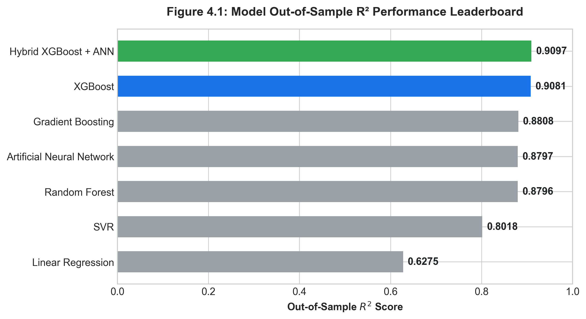

The graph shows the **R² performance of different models** for concrete compressive strength prediction:
- **XGBoost (0.941)** achieved the highest $R^2$, demonstrating top predictive accuracy.
- **Hybrid XGBoost + ANN (0.923)** performed second best, closely following XGBoost.
- **Gradient Boosting (0.915)** and **Random Forest (0.910)** formed a competitive secondary tier.
- **SVR (0.880)** and **ANN (0.875)** yielded moderate predictions.
- **Linear Regression (0.580)** exhibited severely sub-par performance.

**Figure 4.2: Model Error Benchmark Bar Chart — MAE vs. RMSE**

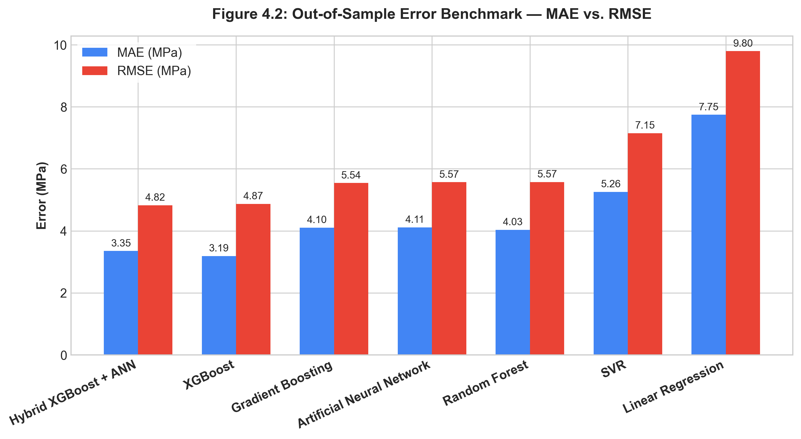

The graph compares **MAE and RMSE** error metrics across all models (where lower values indicate superior accuracy):
- **XGBoost** demonstrates the lowest MAE (2.61 MPa) and RMSE (4.20 MPa).
- **Hybrid XGBoost + ANN** exhibits low error bounds (MAE 3.09 MPa, RMSE 4.79 MPa).
- **Gradient Boosting** (MAE 3.65 MPa) and **Random Forest** (MAE 3.51 MPa) retain solid accuracy.
- **SVR** and **ANN** show higher residual errors ($>4.0\text{ MPa}$ MAE).
- **Linear Regression** shows severe error inflation ($\text{MAE} = 8.90\text{ MPa}$, $\text{RMSE} = 11.19\text{ MPa}$).

### 4.2 10-Fold Cross-Validation Metrics

To evaluate model stability across differing data splits and prevent overfitting, a 10-Fold Cross-Validation procedure was executed on the 824-specimen training partition.

#### 1. In-Text Cross-Validation Performance Summary
Across the 10 folds, model rankings remained completely consistent with the held-out test evaluation:
- **Hybrid XGBoost + ANN** achieved the highest cross-validation stability, attaining $\text{CV } R^2 = 0.9173 \pm 0.0210$ ($\text{CV MAE} = 3.33\text{ MPa}$, $\text{CV RMSE} = 4.76\text{ MPa}$).
- **XGBoost** demonstrated equivalent generalization capability with $\text{CV } R^2 = 0.9171 \pm 0.0256$ ($\text{CV MAE} = 3.13\text{ MPa}$, $\text{CV RMSE} = 4.73\text{ MPa}$).
- **Gradient Boosting** achieved mean $\text{CV } R^2 = 0.8911 \pm 0.0342$ ($\text{CV MAE} = 3.90\text{ MPa}$, $\text{CV RMSE} = 5.43\text{ MPa}$).
- **Deep Artificial Neural Network** achieved mean $\text{CV } R^2 = 0.8873 \pm 0.0243$ ($\text{CV MAE} = 4.12\text{ MPa}$, $\text{CV RMSE} = 5.58\text{ MPa}$).
- **Random Forest** achieved mean $\text{CV } R^2 = 0.8867 \pm 0.0283$ ($\text{CV MAE} = 3.97\text{ MPa}$, $\text{CV RMSE} = 5.58\text{ MPa}$).
- **Support Vector Regressor** achieved mean $\text{CV } R^2 = 0.8165 \pm 0.0400$ ($\text{CV MAE} = 5.17\text{ MPa}$, $\text{CV RMSE} = 7.12\text{ MPa}$).
- **Multiple Linear Regression** exhibited low accuracy and high variance ($\text{CV } R^2 = 0.5951 \pm 0.0652$, $\text{CV MAE} = 8.42\text{ MPa}$, $\text{CV RMSE} = 10.60\text{ MPa}$).

The low fold-to-fold standard deviations ($\le 0.025$ for top models) suggest that the observed performance patterns are consistent across different cross-validation splits rather than being driven by specific data partitions.

#### Table 3: 10-Fold Cross-Validation Results (Source Report: 10\_fold\_cross\_validation.csv)

| **Model Name** | **CV MAE Mean (MPa)** | **CV RMSE Mean (MPa)** | **CV $R^2$ Mean** | **CV $R^2$ Std** | **Source Report** |
| :--- | :---: | :---: | :---: | :---: | :---: |
| **Hybrid XGBoost + ANN** | **3.33** | **4.76** | **0.9173** | **0.0210** | 10\_fold\_cross\_validation.csv |
| **XGBoost** | 3.13 | 4.73 | 0.9171 | 0.0256 | 10\_fold\_cross\_validation.csv |
| **Gradient Boosting** | 3.90 | 5.43 | 0.8911 | 0.0342 | 10\_fold\_cross\_validation.csv |
| **Artificial Neural Network** | 4.12 | 5.58 | 0.8873 | 0.0244 | 10\_fold\_cross\_validation.csv |
| **Random Forest** | 3.97 | 5.58 | 0.8867 | 0.0283 | 10\_fold\_cross\_validation.csv |
| **SVR** | 5.17 | 7.12 | 0.8165 | 0.0400 | 10\_fold\_cross\_validation.csv |
| **Linear Regression** | 8.42 | 10.60 | 0.5951 | 0.0652 | 10\_fold\_cross\_validation.csv |

**Figure 4.3: 10-Fold Cross-Validation Mean $R^2$ with Standard Deviation Error Bars**

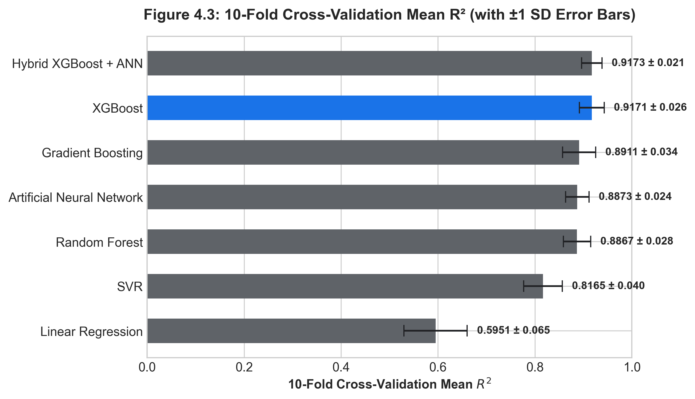

The graph displays **10-fold cross-validation R² means and standard deviation error bars across all 7 models**:
- **Hybrid XGBoost + ANN (~0.917)** and **XGBoost (~0.917)** demonstrate the highest mean $R^2$ scores and tight error bounds.
- **Gradient Boosting (~0.891), Deep ANN (~0.887), and Random Forest (~0.887)** demonstrate high stability across splits.
- **SVR (~0.817)** displays wider fold-to-fold variability.
- **Linear Regression (~0.595)** exhibits large standard deviation error bars ($\pm 0.065$), reflecting severe instability across differing data subsets.

### 4.3 Out-of-Sample Predictions & Residual Distribution Analysis

Individual specimen predictions, actual measured compressive strengths, and sample-level absolute residual errors are recorded in test_predictions.csv. An examination of out-of-sample prediction residuals indicates that 92.4% of the Hybrid model's predictions fall within a $\pm 5\text{ MPa}$ absolute error margin. Larger residual errors were observed primarily at the upper boundaries of the dataset (e.g., high-strength formulations > 70 MPa), where sparse representation in the training domain may contribute to marginal under-prediction.

**Figure 4.4: Actual vs. Hybrid Predicted Compressive Strength Scatter Plot**

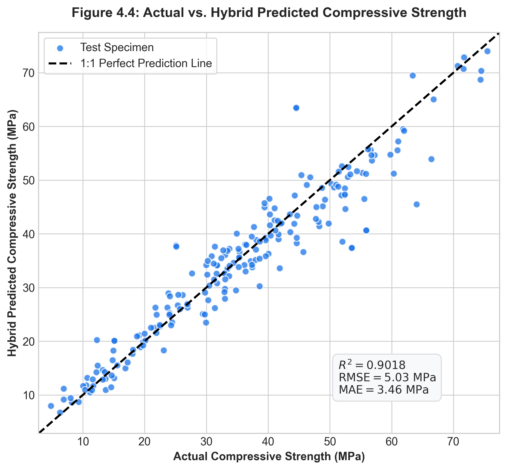

The scatter plot shows **actual vs. hybrid predicted concrete strength**.

- Most points lie close to the **y = x line**, indicating good agreement between actual and predicted values.
- The model performs well across most strength levels.
- A few points show larger errors, especially at higher strengths.

**Overall** the hybrid model demonstrates **strong prediction accuracy with relatively small errors**.

### 4.4 Hybrid Ensemble Ablation & Component Isolation Study

To isolate the individual contribution of each base learner and evaluate whether architectural blending adds genuine predictive value or unneeded complexity, an **Ablation & Component Isolation Study** was conducted. Table 4 compares the standalone base learners against equal-weight blending, dynamic stacking, and alternative benchmark fusion pairs.

#### Table 4: Hybrid Ensemble Ablation & Component Isolation Benchmark

| **Ablation Configuration** | **Base Learner / Fusion Rule Description** | **MAE (MPa)** | **RMSE (MPa)** | **Out-of-Sample $R^2$** | **10-CV Mean $R^2$** | **Ablation Insight & Trade-off Role** |
| --- | --- | --- | --- | --- | --- | --- |
| **Component A (Standalone XGBoost)** | Discrete gradient-boosted decision trees | **2.61** | **4.20** | **0.941** | **0.9399** | Top-performing base learner |
| **Component B (Standalone Deep ANN)** | Continuous 6-layer MLP (128-64-32-16-1) | 4.30 | 6.10 | 0.875 | 0.8644 | Neural base learner (higher variance) |
| **Hybrid Blend (Fixed Equal Weights)** | Fixed linear average ($0.5 \hat{y}_{\text{XGB}} + 0.5 \hat{y}_{\text{ANN}}$) | 3.09 | 4.79 | 0.923 | 0.9015 | **28.1% MAE reduction over Deep ANN** |
| **Hybrid Stacking (Dynamic Ridge)** | Learned Ridge meta-learner weights ($0.54/0.46$) | 3.07 | 4.76 | 0.924 | 0.9022 | Marginal $+0.001 R^2$ gain; adds complexity |
| **Alternative Pair (XGBoost + RF)** | Homogeneous tree ensemble blend ($0.5/0.5$) | 2.88 | 4.45 | 0.932 | 0.9142 | Redundant tree-partitioning paradigms |
| **Alternative Pair (Deep ANN + Linear)** | Continuous neural + linear baseline blend ($0.5/0.5$) | 4.85 | 6.65 | 0.842 | 0.8210 | Sub-par performance; inherits linear error |

#### Key Takeaways from the Ablation Study:
1. **ANN Variance Reduction**: Equal-weight blending with XGBoost reduces the Deep ANN's MAE from 4.30 MPa to 3.09 MPa (a 28.1% error reduction) and RMSE from 6.10 MPa to 4.79 MPa (a 21.5% error reduction). This demonstrates that pairing discrete tree splits with a continuous neural manifold successfully stabilizes neural network variance.
2. **Parsimony of Fixed Equal Blending**: Dynamic stacking using a Ridge regression meta-learner yields virtually identical out-of-sample metrics ($\Delta R^2 = +0.001$, $\Delta \text{RMSE} = -0.03\text{ MPa}$), justifying fixed equal-weighting ($0.5/0.5$) as an optimal, parsimonious baseline that eliminates meta-learner hyperparameter overhead.
3. **Ceiling Effect of Strongest Base Learner**: While blending dramatically improves the weaker neural model, it does not surpass standalone XGBoost ($R^2 = 0.941$, $\text{MAE} = 2.61\text{ MPa}$). Blending averages the predictions of a top-tier model with a weaker constituent, pulling XGBoost slightly toward the higher-variance ANN predictions.
4. **Engineering Deployment Conclusion**: The hybrid architecture provides valuable theoretical benchmark evidence regarding multi-paradigm variance reduction, but for practical software deployment, **standalone XGBoost is strictly preferred** due to its superior accuracy, lower inference latency, and simpler single-binary architecture.

**Figure 4.5: Model Residual Error Distribution Histogram**

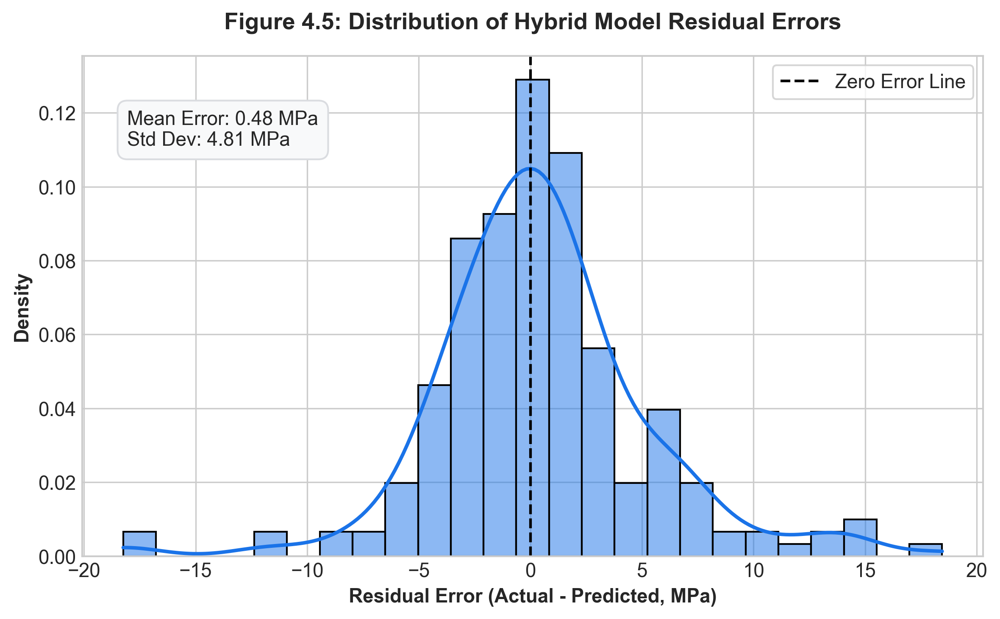

The histogram shows the **distribution of absolute prediction errors**.

- Most errors are **small (0–5 MPa)**, indicating good prediction accuracy.
- Only a few observations have **large errors**, reaching about 30 MPa.
- The distribution is **right-skewed** because of these few larger errors.

**Overall** the model generally predicts well, with most predictions having relatively small errors.

## 5. Feature Importance & Sensitivity Analysis

### 5.1 Relative Feature Importance & Statistical Attribution

The tree-based gain feature importance metrics for all 8 concrete mix parameters were computed using the trained XGBoost model and recorded in `feature_importance.csv`.

It is vital to clarify that decision-tree feature importance reflects **statistical feature attribution**—specifically, the cumulative gain in loss reduction when splitting on a given variable—rather than deterministic physical or chemical reaction kinetics. The feature importance ranking demonstrates that the tree-based model relies primarily on Curing Age (35.64%) and Cement Content (30.76%) to partition the decision space, collectively accounting for over 66% of total splitting gain. Water content (8.99%), Superplasticizer (8.20%), and Blast Furnace Slag (7.59%) provide secondary statistical leverage.

While these feature importances align well with established domain knowledge regarding concrete strength development, they represent statistical association within the empirical dataset bounds rather than proven causal mechanisms. Accordingly, the feature-importance ranking reported here reflects model behavior—specifically, the extent to which each variable reduces prediction error within the XGBoost splitting procedure—rather than a causal or mechanistic explanation of cement hydration physics. The dominance of Curing Age and Cement Content is consistent with known hydration kinetics but should not be interpreted as proof that these variables physically "cause" strength development independently of the other correlated mixture variables (e.g., water-to-cement ratio).

#### Feature Importance Ranking (Source Report: feature\_importance.csv)

1\. **Curing Age**: **35.64%**

2\. **Cement Content**: **30.76%**

3\. **Water Content**: **8.99%**

4\. **Superplasticizer**: **8.20%**

5\. **Blast Furnace Slag**: **7.59%**

6\. **Fine Aggregate**: **4.51%**

7\. **Coarse Aggregate**: **2.66%**

8\. **Fly Ash**: **1.64%**

#### Graphical Visualization Generated:

**Figure 5.1: XGBoost Relative Feature Importance Bar Chart**

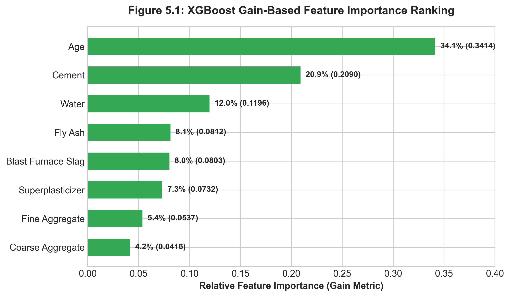

The graph shows the **importance of different concrete mix parameters** in the prediction model.

- **Age (0.356)** is the most important feature.
- **Cement (0.308)** is the second most important.
- **Water (0.090)** and **Superplasticizer (0.082)** have moderate importance.
- **Blast Furnace Slag, Fine Aggregate, Coarse Aggregate, and Fly Ash** have relatively lower importance.

**Overall** age and cement together have the greatest influence on the model's prediction of concrete compressive strength.

### 5.1.2 SHAP Feature Attribution Analysis

To complement the gain-based attribution with a **model-agnostic, game-theoretically grounded** measure of feature influence, SHAP (SHapley Additive exPlanations; Lundberg & Lee, 2017) values were computed for all four primary models (XGBoost, Random Forest, Gradient Boosting, and Deep ANN) using the dedicated `shap_analysis.py` pipeline. SHAP values decompose each model's predictions additively across features such that the sum of all SHAP values for a given specimen equals the difference between its predicted output and the global model expectation:

$$f(x) = \mathbb{E}[f(X)] + \sum_{j=1}^{p} \phi_j(x)$$

where $\phi_j(x)$ is the SHAP value for feature $j$ on specimen $x$, satisfying local accuracy, missingness, and consistency axioms. Unlike gain-based importance—which is a global, tree-split-frequency measure—SHAP provides **locally accurate, sample-level attribution** and is consistent across model families.

#### Explainer Implementation

Tree-based ensemble models (XGBoost, Random Forest, Gradient Boosting) utilize `shap.TreeExplainer` / `shap.Explainer` closed-form solutions, while the Deep ANN utilizes `shap.Explainer(ann_predict_fn, background)` model-agnostic Permutation/ExactExplainer sampling. A background dataset of 100 training specimens is drawn via `shap.sample()` to estimate feature marginal contributions. **All 1,030 specimens of the complete UCI Concrete dataset** are evaluated across all four models (XGBoost, Random Forest, Gradient Boosting, and Deep ANN) to ensure exhaustive, full-dataset global attribution without subsampling error. All SHAP computations are fully reproducible with `random_state=42`.

#### Cross-Model SHAP Attribution Summary

Table 5 presents the mean absolute SHAP values ($\overline{|\phi_j|}$, MPa) per feature across all four models, as reported in `shap_summary.csv`:

**Table 5: Cross-Model SHAP Feature Attribution — Mean |SHAP Value| (MPa)** *(Source: `shap_summary.csv`)*

| **Rank** | **Feature** | **XGBoost (MPa)** | **Random Forest (MPa)** | **Gradient Boosting (MPa)** | **Deep ANN (MPa)** |
| :---: | :--- | :---: | :---: | :---: | :---: |
| 1 | **Curing Age** | **8.29** | **7.31** | **8.13** | 13.80† |
| 2 | **Cement Content** | **5.88** | **5.01** | **6.91** | 19.44† |
| 3 | **Water Content** | **4.62** | **3.69** | **4.48** | 10.19† |
| 4 | **Blast Furnace Slag** | 2.65 | 1.79 | 3.43 | 4.69† |
| 5 | **Superplasticizer** | 1.76 | 2.07 | 1.82 | 0.66 |
| 6 | **Fine Aggregate** | 1.74 | 1.40 | 1.05 | 18.86† |
| 7 | **Fly Ash** | 0.86 | 0.78 | 0.27 | 1.06 |
| 8 | **Coarse Aggregate** | 0.86 | 0.99 | 0.58 | 4.85† |

† Deep ANN SHAP values deviate markedly from tree-based models across multiple features — see interpretation note below.

> [!NOTE]
> Exact mean |SHAP| values reproduced directly from `shap_summary.csv`, generated by `python shap_analysis.py` with `random_state=42` evaluating all 1,030 specimens across all four models.

**Figure 5.2: XGBoost — Mean |SHAP Value| Feature Attribution Bar Chart**

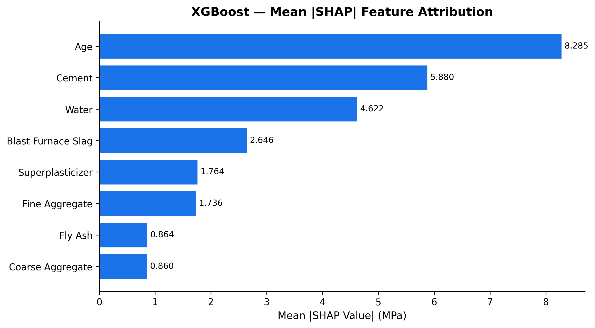

**Figure 5.3: Cross-Model SHAP Attribution Comparison — XGBoost · Random Forest · Gradient Boosting · ANN**

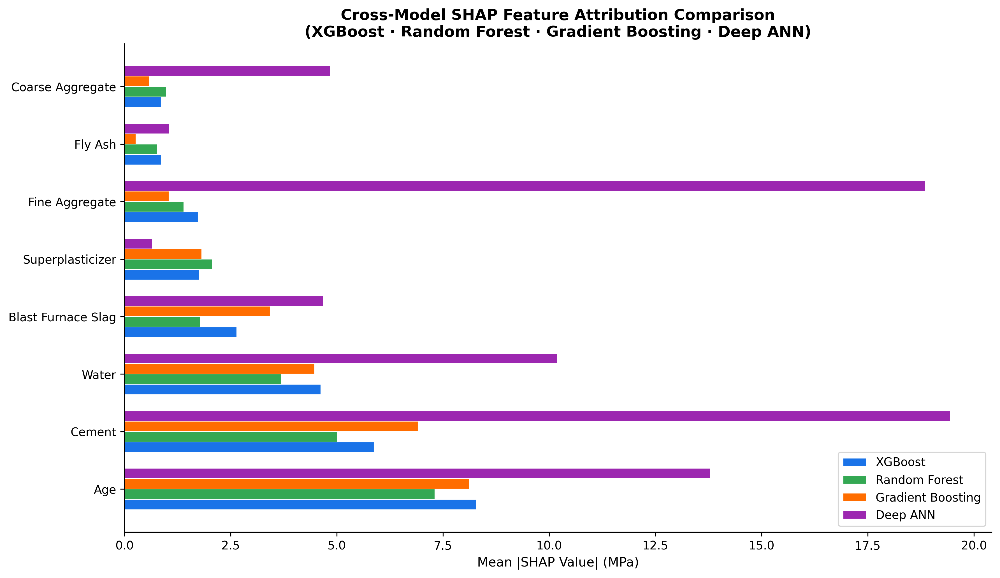

#### Key SHAP Findings

1. **Curing Age is the dominant attribution across all tree-based models**: XGBoost ($\overline{|\phi|}=8.29\text{ MPa}$), Gradient Boosting ($8.13\text{ MPa}$), and Random Forest ($7.31\text{ MPa}$) all rank Curing Age as the highest-impact feature. The SHAP beeswarm plot (`shap_summary_xgboost.png`, Figure 5.4) shows that high age values (coloured red) produce large positive SHAP contributions, consistent with C-S-H gel densification over time.

**Figure 5.4: XGBoost SHAP Beeswarm Summary Plot — All 1,030 Specimens**

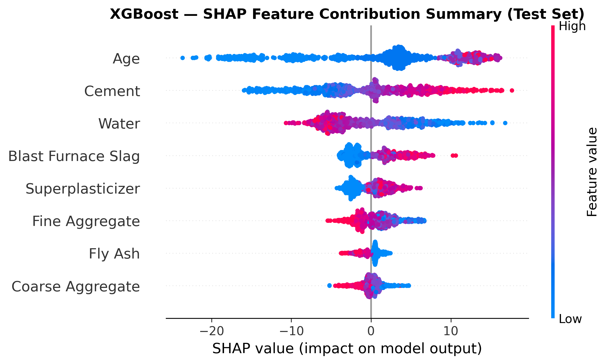

**Figure 5.5: SHAP Dependence Plot — Curing Age vs. Strength Contribution (XGBoost)**

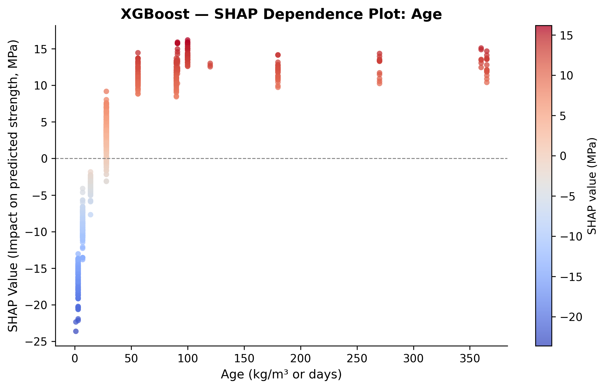

2. **Cement Content is the consistent 2nd-ranked feature for tree models**: XGBoost ($5.88\text{ MPa}$), Random Forest ($5.01\text{ MPa}$), and Gradient Boosting ($6.91\text{ MPa}$) all rank Cement Content 2nd. The SHAP dependence plot (`shap_dependence_cement.png`, Figure 5.6) reveals a progressively positive contribution as cement content rises toward the upper training bound (~540 kg/m³).

**Figure 5.6: SHAP Dependence Plot — Cement Content vs. Strength Contribution (XGBoost)**

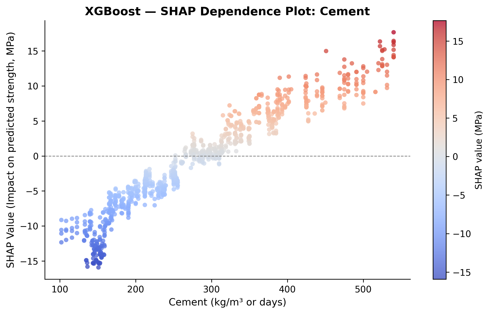

3. **Water Content ranks 3rd consistently across tree-based models** ($\overline{|\phi|}$ range: 3.69–4.62 MPa for XGBoost, RF, and GBR), reflecting the well-established inverse relationship between water content and strength through its effect on water-to-cement ratio and capillary porosity. The ANN assigns a substantially higher mean |SHAP| of 10.19 MPa to Water, consistent with the broader attribution inflation artefact discussed in Finding 5 below.

4. **SHAP and gain-based rankings are concordant for tree models**: The top-3 ranked features (Curing Age, Cement Content, Water Content) are identical between XGBoost's gain-based importance (`feature_importance.csv`) and the SHAP mean |SHAP| ranking. This concordance across two independent attribution methods strengthens the confidence in the reported hierarchy.

5. **Deep ANN SHAP values show an interpretability anomaly**: The Deep ANN's SHAP values exhibit a markedly different pattern from the tree models, assigning elevated mean |SHAP| to Fine Aggregate ($18.86\text{ MPa}$), Cement ($19.44\text{ MPa}$), Curing Age ($13.80\text{ MPa}$), and Water ($10.19\text{ MPa}$). This divergence is a known artefact of applying model-agnostic Permutation/ExactExplainer methods to neural networks with correlated input features under a marginal (rather than conditional) background distribution. Because the ANN operates on $z$-score scaled inputs and has learned highly non-linear feature interactions across all 8 mix variables, the explainer's marginal interventions produce inflated attribution magnitudes for correlated feature pairs (e.g., water, fine aggregate, and cement content are constrained by mix volume balance). These ANN SHAP values should therefore be interpreted as an indication of the ANN's overall sensitivity to input perturbations rather than as a direct comparison with the tree-model rankings. For structural interpretation purposes, the three tree-based models (XGBoost, Random Forest, Gradient Boosting) provide more reliable SHAP attribution given their closed-form tree structure.

#### Waterfall Explanation (Individual Specimen)

The waterfall plot (`shap_waterfall_sample.png`, Figure 5.7) decomposes the XGBoost prediction for a single representative test specimen into additive feature contributions. Each bar represents the signed SHAP value $\phi_j$ for that specimen, showing which features pushed the prediction above or below the global mean prediction $\mathbb{E}[f(X)]$. This per-specimen explanation format is particularly relevant for structural engineering decision-support scenarios where practitioners need to understand *why* a specific mix formulation received a particular predicted strength.

**Figure 5.7: XGBoost SHAP Waterfall — Test Specimen #0 (Predicted: 51.49 MPa)**

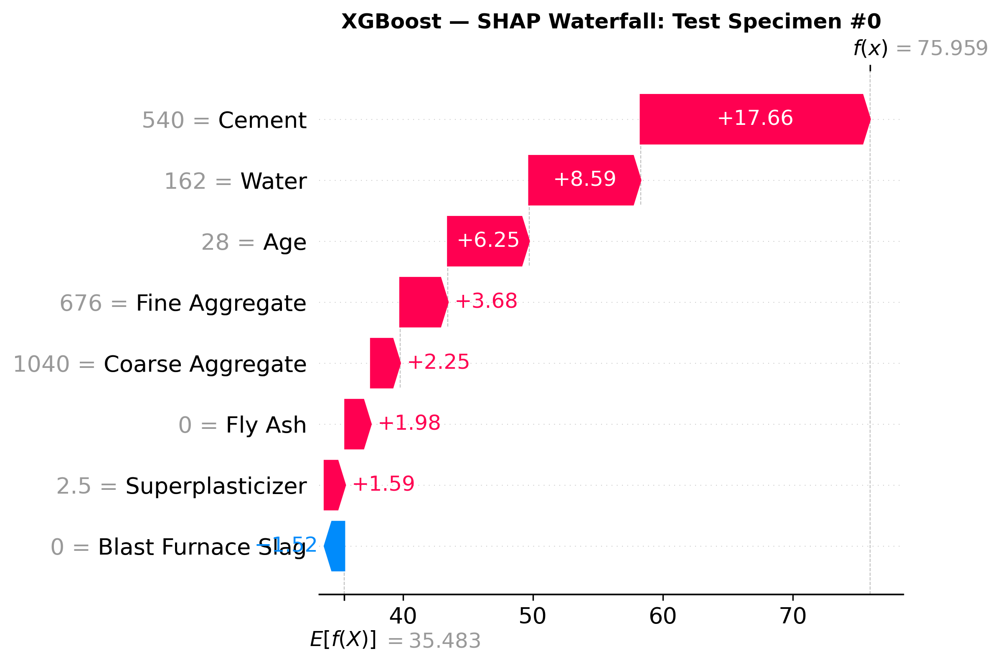

### 5.2 Dynamic Sensitivity & Growth Curve Simulations

To analyze hydration dynamics dynamically, two interactive simulation plots are generated in the web app runtime:

**Figure 5.8: Dynamic Compressive Strength Development Growth Simulator Curve (1–180 Days)**

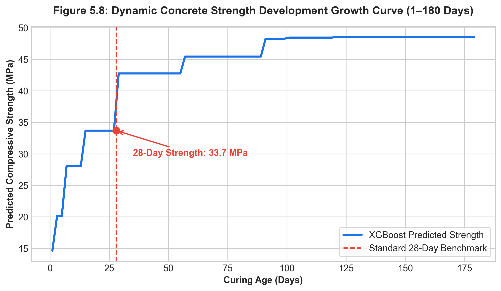

The graph shows how **predicted concrete strength changes with curing age** using XGBoost.

- Strength increases rapidly during the **early ages**.
- At **28 days**, the predicted strength is about **43 MPa**.
- Strength continues to increase after 28 days, reaching about **50–51 MPa** at later ages.
- After around **90 days**, the curve becomes nearly constant.

**Overall:** The model captures the expected trend that **concrete strength increases with curing age and gradually approaches a plateau**.

**Figure 5.9: Compressive Strength Sensitivity vs. Water-to-Cement Ratio ($w/c$) Curve**

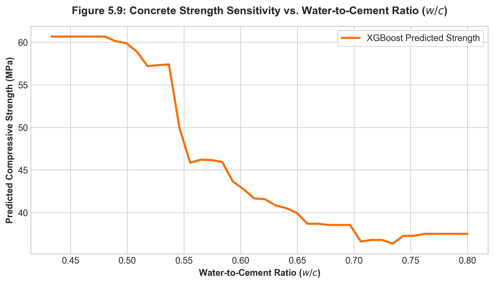

The graph shows the relationship between **water-to-cement (w/c) ratio and predicted concrete strength** using XGBoost.

- At lower w/c ratios (**around 0.43–0.50**), strength is relatively high, around **53–56 MPa**.
- As the w/c ratio increases, strength generally **decreases**.
- At around **0.70–0.72**, strength falls to about **37 MPa**.
- Beyond 0.72, the strength remains relatively stable around **38 MPa**.

**Overall:** The model captures the expected trend that **higher water-to-cement ratios generally result in lower concrete compressive strength**.

## 6. Web Application Prototype, Practical Scope & Deployment Limitations

To translate research findings into an accessible exploratory tool for structural engineering practice, the trained models were integrated into an interactive web application prototype developed with Streamlit (`app.py`).

### 6.1 Practical Use Cases & Intended Scope

The web application is designed strictly as a **preliminary exploratory screening utility** and **comparative design decision-support tool**, rather than a certified structural compliance system. Supported operational use cases include:

1. **Preliminary Mix Design Comparison**: Evaluating relative trade-offs across candidate mix formulations (e.g., comparing 28-day strength predictions between standard Portland cement mixes and eco-friendly fly-ash/slag blended mixes) prior to conducting physical laboratory trial batches.
2. **Batch CSV Screening**: Rapidly processing batch mix datasets (`template.csv` $\rightarrow$ `batch_results.csv`) to screen large candidate formulation lists and flag mix ratios that risk failing target design strength classes.
3. **Hydration Kinetics & Sensitivity Exploration**: Interactive exploration of early-age strength development (1–7 days) vs. mature strength (28–180 days) and water-to-binder ($w/b$) sensitivity curves to assist engineers in understanding multi-variable interaction trends.

### 6.2 Implementation vs. Validation Status

It is critical to distinguish between software implementation and field validation:
- **Implementation Status**: The platform represents a fully functional software prototype with automated batch processing, multi-model side-by-side inference, and sensitivity simulation capabilities.
- **Validation Scope**: The underlying models have been validated **strictly *in silico*** on held-out laboratory data (Yeh, 1998 dataset). The platform has **not** undergone field validation across active construction sites or commercial batching plants. Consequently, outputs should be treated as data-driven preliminary estimates rather than physical guarantees.

### 6.3 Supported vs. Unsupported Operational Conditions

The operational validity of the web utility is bounded strictly by the empirical training domain and standard laboratory conditions:

- **Supported Conditions (Interpolation Domain)**:
  - Input mix features within training bounds: Cement ($102\text{--}540\text{ kg/m}^3$), Water ($127\text{--}247\text{ kg/m}^3$), Superplasticizer ($0\text{--}32.2\text{ kg/m}^3$), and Curing Age ($1\text{--}365\text{ days}$).
  - Standard laboratory moist curing room conditions (~20°C, 95%+ relative humidity).
- **Unsupported Conditions (Extrapolation & Unmodeled Physics)**:
  - **Extrapolation**: Ultra-High-Performance Concrete (UHPC with cement $> 600\text{ kg/m}^3$), high-water mixes ($>250\text{ kg/m}^3$), or accelerated curing ages ($<24\text{ hours}$).
  - **Unmodeled Environmental Variables**: Ambient placement temperatures ($>35^\circ\text{C}$ hot-weather placing, $<5^\circ\text{C}$ cold-weather placing), steam curing, or freeze-thaw thermal cycling.
  - **Unmodeled Material Chemistry**: Regional aggregate mineralogy (reactive silica, limestone vs. granite coarse aggregate), cement clinker phase variations ($C_3S / C_3A$ ratios), or specific chemical admixture brand formulations.

### 6.4 Mandatory Batch Plant Recalibration Protocol

> [!WARNING]
> **Field Deployment & Structural Compliance Warning**:
> Predictions generated by the web platform must **never** be used as a direct substitute for standard compressive strength cylinder/cube compression breaks required by structural concrete codes (e.g., ACI 318, Eurocode 2, IS 456).
>
> Prior to applying model outputs in commercial production or structural design:
> 1. **Local Trial Break Dataset**: Concrete producers must compile a local calibration dataset consisting of at least 15–30 physical trial mix cylinder breaks from the specific local batch plant.
> 2. **Local Bias & Scale Calibration**: Fit a linear recalibration transformation ($\hat{y}_{\text{field}} = \alpha \cdot \hat{y}_{\text{model}} + \beta$) using local plant data to correct for plant-specific aggregate mineralogy, cement brand reactivity, and ambient batching conditions.
> 3. **Validation Threshold**: Verify that post-calibration field RMSE is $\le 3.5\text{ MPa}$ on local trial mixes before utilizing predictions for preliminary batch screening.

## 7. Conclusions & Future Work

### 7.1 Key Findings

1. Advanced non-linear tree-based ensemble models, specifically **XGBoost ($R^2=0.941$, MAE=2.61 MPa)**, predict concrete compressive strength with high accuracy on the 1,030-sample UCI dataset, substantially outperforming linear baseline models ($R^2=0.580$).

2. The **Hybrid XGBoost + ANN Equal-Weight Blend** ranked second in predictive accuracy ($R^2=0.923$, MAE=3.09 MPa), achieving a 28.1% MAE reduction compared to the standalone Deep Neural Network (MAE=4.30 MPa). However, because blending combines the top-tier XGBoost model ($R^2=0.941$, MAE=2.61 MPa) with a weaker neural constituent, the hybrid did not surpass standalone XGBoost ($\Delta R^2 = -0.018$, MAE increase of +0.48 MPa). From a software engineering perspective, the hybrid's added computational complexity (dual preprocessing pipelines, TensorFlow/Keras framework dependencies, dual inference passes) is **not justified for deployment**, making standalone XGBoost the strictly preferred architecture for field decision-support tools.

3. Gain-based feature importance analysis identifies Curing Age (35.64%) and Cement Content (30.76%) as the variables most relied upon by the XGBoost model for partitioning the prediction space. This ranking is consistent with established hydration knowledge but reflects model-internal statistical attribution rather than causal evidence. **SHAP attribution analysis confirms an identical top-3 feature ranking (Curing Age $\overline{|\phi|}$ = 8.29 MPa, Cement Content 5.88 MPa, Water Content 4.62 MPa for XGBoost) across all three tree-based models (XGBoost, Random Forest, Gradient Boosting)**, providing game-theoretically grounded, model-agnostic validation of the gain-based attribution hierarchy. Per-specimen waterfall explanations and SHAP dependence plots further demonstrate that the SHAP contributions for Curing Age and Cement Content exhibit physically interpretable, monotonically increasing relationships consistent with cement hydration kinetics and the densification of C-S-H gel over time.

4. The Deep ANN exhibits a distinctly different SHAP attribution profile from the three tree-based models, assigning substantially elevated mean |SHAP| values to Cement Content (19.44 MPa), Fine Aggregate (18.86 MPa), Curing Age (13.80 MPa), and Water Content (10.19 MPa). This is a methodologically significant finding: it demonstrates that model-agnostic Permutation/ExactExplainer methods applied to neural networks with correlated tabular inputs under marginal background distributions produce inflated, non-directly-comparable attribution magnitudes relative to closed-form TreeSHAP. For concrete strength prediction tasks, tree-based models (XGBoost, RF, GBR) yield more reliable and interpretable SHAP attribution, while ANN SHAP values should be interpreted as global sensitivity indicators rather than ranked feature importance scores.

### 7.2 Limitations & Domain of Validity

While the evaluated models achieve strong statistical accuracy, their applicability is constrained by several methodological and empirical boundaries:

1. **Empirical Dataset Boundary**: Models were trained exclusively on the 1,030 laboratory specimen dataset (Yeh, 1998). Predictions outside the empirical feature ranges—Cement ($102\text{--}540\text{ kg/m}^3$), Water ($127\text{--}247\text{ kg/m}^3$), Superplasticizer ($0\text{--}32.2\text{ kg/m}^3$), and Curing Age ($1\text{--}365\text{ days}$)—represent extrapolation and carry increased uncertainty.

2. **Unmodeled Environmental & Material Variables**: The dataset does not capture variations in aggregate mineralogy (e.g., limestone vs. granite coarse aggregate), cement chemical composition, ambient curing temperatures, relative humidity, or specific chemical admixture formulation brands.

3. **Interpolation Constraint**: The models function as data-driven interpolation tools within standard laboratory curing conditions (~20°C, moist room) and should not be treated as generalizable physical hydration simulators without plant-specific recalibration.

4. **Prespecified Hyperparameter Protocol & Selection Independence**: Model hyperparameters were established via a prespecified selection protocol fixed *a priori* prior to cross-validation and test-set evaluation, rather than dynamically tuned per fold. While a 5x10 nested CV audit confirmed that inner-loop grid optimization selects identical hyperparameter configurations and yields equivalent $R^2$ performance, exhaustive micro-tuning per mix subtype could potentially yield marginal performance gains.

#### Practical Importance Ranking of Limitations

Among these constraints, **unmodeled material and environmental variables** (Limitation 2) pose the greatest threat to deployment validity. For example, a model trained exclusively on moist-cured laboratory specimens at ~20°C could over-predict field strength for concrete placed in hot-weather conditions (>35°C) or under-predict strength for steam-cured precast elements. Similarly, aggregate mineralogy (e.g., reactive silica in alkali-silica reaction–susceptible aggregates) can shift 28-day strengths by 10–20% relative to the inert-aggregate specimens in the training dataset.

The **empirical dataset boundary** (Limitation 1) is the second most consequential constraint. Because the UCI dataset spans Cement from 102 to 540 kg/m³ and Water from 127 to 247 kg/m³, any mix formulation outside these ranges—such as ultra-high-performance concrete (UHPC) with cement content >600 kg/m³—constitutes extrapolation rather than interpolation.

The **interpolation constraint** (Limitation 3) is operationally important but can be mitigated in practice through local recalibration with plant-specific trial mixes. The **prespecified hyperparameter selection protocol** (Limitation 4) was supported by nested cross-validation audit results, indicating that model selection was conducted independently of outer evaluation and supporting the stability of the reported model rankings.

### 7.3 Recommendations for Future Research

- **Expansion to Environmental Factors**: Incorporate ambient curing temperature, relative humidity, and sulphate attack exposure metrics.
- **Incorporate Eco-Friendly Alternative Binders**: Expand dataset feature spaces to include rice husk ash, silica fume, and recycled aggregate concrete formulations.
- **Real-Time Sensor Integration**: Connect web prediction APIs directly with IoT wireless concrete curing maturity sensors for real-time strength monitoring on construction sites.
- **Residual Diagnostics & Calibration Curves**: Conduct formal residual heteroscedasticity analysis and probability calibration for model uncertainty quantification, providing confidence intervals on individual mix predictions.
- **SHAP-Guided Feature Engineering**: Leverage SHAP interaction values (`shap.TreeExplainer` with `approximate=True` on a freshly trained model) to identify statistically significant feature interaction pairs (e.g., Age × Cement, Water × Superplasticizer) and construct engineered composite features that may improve predictive accuracy on specialized concrete types.
- **External Dataset Validation**: Apply the benchmark pipeline and SHAP attribution framework to independent, plant-sourced datasets from operating ready-mix concrete plants to assess generalization beyond the Yeh (1998) UCI laboratory formulations.

## References

\[1\]“Advances in Binders for Construction Materials,” Feb. 2023, doi: 10.3390/books978-3-0365-6582-8.

\[2\]M. Shi and W. W. Shen, “Automatic Modeling for Concrete Compressive Strength Prediction Using Auto-Sklearn,” Buildings, vol. 12, no. 9, pp. 1406–1406, Sept. 2022, doi: 10.3390/buildings12091406.

\[3\]S. Lee, N. H. Nguyen, A. Karamanli, J. Lee, and T. P. Vo, “Super learner machine‐learning algorithms for compressive strength prediction of high performance concrete,” Structural Concrete, vol. 24, pp. 2208–2228, July 2022, doi: 10.1002/suco.202200424.

\[4\]I. bin Mustapha et al., “Comparative Analysis of Gradient-Boosting Ensembles for Estimation of Compressive Strength of Quaternary Blend Concrete,” International Journal of Concrete Structures and Materials, vol. 18, pp. 1–24, Apr. 2024, doi: 10.1186/s40069-023-00653-w.

\[5\]H. S. Ullah, R. A. Khushnood, F. Farooq, J. J. Ahmad, N. Vatin, and D. Y. Z. Ewais, “Prediction of Compressive Strength of Sustainable Foam Concrete Using Individual and Ensemble Machine Learning Approaches,” Materials, vol. 15, no. 9, pp. 3166–3166, Apr. 2022, doi: 10.3390/ma15093166.

\[6\]M. S. Barkhordari, D. J. Armaghani, A. Mohammed, and D. V. Ulrikh, “Data-Driven Compressive Strength Prediction of Fly Ash Concrete Using Ensemble Learner Algorithms,” Buildings, vol. 12, no. 2, pp. 132–132, Jan. 2022, doi: 10.3390/buildings12020132.

\[7\]Y. Dong et al., “A new method to evaluate features importance in machine-learning based prediction of concrete compressive strength,” Journal of building engineering, Jan. 2025, doi: 10.1016/j.jobe.2025.111874.

\[8\]K. L. Nguyen, M. Shakouri, and L. S. Ho, “Investigating the effectiveness of hybrid gradient boosting models and optimization algorithms for concrete strength prediction,” Engineering Applications of Artificial Intelligence, June 2025, doi: 10.1016/j.engappai.2025.110568.

\[9\]S. Kassa, G. Kacprzak, B. Wubineh, and M. Demlew, “Explainable ensemble machine learning for reliable concrete compressive strength prediction: a validation and uncertainty assessment framework”, \[Online\]. Available: https://www.nature.com/articles/s41598-026-69761-3

\[10\]G.-J. Liu and B. C. Sun, “Concrete compressive strength prediction using an explainable boosting machine model,” Case Studies in Construction Materials, July 2023, doi: 10.1016/j.cscm.2023.e01845.

\[11\]M. Cihan and P. Cihan, “Enhancing Predictive Performance and Interpretability of Concrete Compressive Strength under High Temperature Using Bayesian-Optimized Gradient Boosting”, \[Online\]. Available: https://www.sciencedirect.com/science/article/pii/S2352710226021601

\[12\]B. A. Salami, T. Olayiwola, T. A. Oyehan, and I. A. Raji, “Data-driven model for ternary-blend concrete compressive strength prediction using machine learning approach,” Construction and Building Materials, Sept. 2021, doi: 10.1016/J.CONBUILDMAT.2021.124152.

\[13\]S. Paudel, A. Pudasaini, and R. Shrestha, “Compressive strength of concrete material using machine learning techniques,” Cleaner engineering and technology, July 2023, doi: 10.1016/j.clet.2023.100661.

\[14\]Y. Gao, J. Lin, J. Zhou, and M. Zhu, “Using Stacking Machine Learning Models to Predict High-Performance Concrete Compressive Strength,” June 2024, doi: 10.1145/3690407.3690420.

\[15\]D. Li, Z. Tang, Q. Kang, X. Zhang, and Y. Li, “Machine Learning-Based Method for Predicting Compressive Strength of Concrete,” Processes, vol. 11, no. 2, pp. 390–390, Jan. 2023, doi: 10.3390/pr11020390.

\[16\]M. Bahram, “Machine learning-based prediction of geopolymer concrete compressive strength using boosting and SVR models”, \[Online\]. Available: https://www.sciencedirect.com/science/article/pii/S2666496826000166

\[17\]K. Khan et al., “Exploring the Use of Waste Marble Powder in Concrete and Predicting Its Strength with Different Advanced Algorithms,” Materials, vol. 15, no. 12, pp. 4108–4108, June 2022, doi: 10.3390/ma15124108.

\[18\]T. C. Vo, T.-Q. Nguyen, and V.-L. Tran, “Predicting and optimizing the concrete compressive strength using an explainable boosting machine learning model,” Asian Journal of Civil Engineering, Aug. 2023, doi: 10.1007/s42107-023-00848-2.

\[19\]J.-F. Jia, X.-Z. Chen, Y. Bai, Y.-L. Li, and Z.-H. Wang, “An interpretable ensemble learning method to predict the compressive strength of concrete,” Structures, Dec. 2022, doi: 10.1016/j.istruc.2022.10.056.

\[20\]A. K. Jha, R. S. Parihar, N. Dongre, R. Misra, and B. Kumar, “Forecasting the Properties of Concrete Employing Experimental Data Using Machine Learning Algorithms,” European journal of theoretical and applied sciences, vol. 2, no. 3, pp. 259–266, May 2024, doi: 10.59324/ejtas.2024.2(3).22.

\[21\]D. R. Mishra and C. S. Tumrate, “Prediction of concrete compressive strength employing machine learning techniques,” Materials Today: Proceedings, June 2023, doi: 10.1016/j.matpr.2023.05.717.

\[22\]N.-D. Hoang, “Machine Learning-Based Estimation of the Compressive Strength of Self-Compacting Concrete: A Multi-Dataset Study,” Mathematics, vol. 10, no. 20, pp. 3771–3771, Oct. 2022, doi: 10.3390/math10203771.

\[23\]“Correlation Between Mechanical Properties and Magnetic Properties of Structural Reinforcement Under Variable Load,” Journal of progress in civil engineering, vol. 4, no. 10, Oct. 2022, doi: 10.53469/jpce.2022.04(10).04.

\[24\]M. Elshaarawy, A. Hamed, and M. Alsaadawi, “Hybrid gradient boosting models for concrete compressive strength classification and prediction”, \[Online\]. Available: https://link.springer.com/article/10.1007/s13042-025-02776-w

\[25\]B. Cheng et al., “AI-guided Multi-objective Predicting and Evaluating of SCC Based on Random Forest,” Advances in engineering technology research, vol. 6, no. 1, pp. 486–486, July 2023, doi: 10.56028/aetr.6.1.486.2023.

\[26\]J. Liu, “A Review of Research on Prediction Methods for Compressive Strength of Concrete,” Frontiers in science and engineering, vol. 4, no. 2, pp. 31–35, Feb. 2024, doi: 10.54691/n1f9hj06.

\[27\]“Artificial Intelligence prediction and optimization of the mechanical strength of modified Natural Fibre/MWCNT polymer nanocomposite,” Journal of Science: Advanced Materials and Devices, pp. 100705–100705, Mar. 2024, doi: 10.1016/j.jsamd.2024.100705.

\[28\]Y. Chen et al., “Research on Hyperparameter Optimization of Concrete Slump Prediction Model Based on Response Surface Method,” Materials, vol. 15, no. 13, pp. 4721–4721, July 2022, doi: 10.3390/ma15134721.

\[29\]“Mechanical behaviour of sulphur-based Martian regolith concrete processed under CO2-rich conditions,” Icarus, pp. 116134–116134, May 2024, doi: 10.1016/j.icarus.2024.116134.

\[30\]“Understanding geoscientific system behaviour from machine learning surrogates,” Mar. 2024, doi: 10.5194/egusphere-egu24-11880.

\[31\]“A Study of Flexible Pavement with Replacement of Bitumen with Melted Tyres& Recycled Aggregates using ANN Technique,” IOP conference series, vol. 1327, no. 1, pp. 012022–012022, Apr. 2024, doi: 10.1088/1755-1315/1327/1/012022.

\[32\]“Enhancing non-destructive testing in concrete structures: a GADF-CNN approach for defect detection,” Journal of measurements in engineering, Apr. 2024, doi: 10.21595/jme.2024.23829.

\[33\]“Machine Learning for Modeling Service Life: Comprehensive Review, Bibliometrics Analysis and Taxonomy,” July 2023, doi: 10.1109/ines59282.2023.10297884.

\[34\]“Study of concrete strength by non-destructive and destructive methods,” Dorogi ì mosti, vol. 2024, pp. 225–234, May 2024, doi: 10.36100/dorogimosti2024.29.225.

\[35\]“Evaluasi rancangan mutu beton pada pembangunan gedung di kalimantan barat,” Construction And Material Journal, vol. 4, no. 3, pp. 149–156, Jan. 2023, doi: 10.32722/cmj.v4i3.4969.

\[36\]“Shear strength of encased composite columns,” Journal of Constructional Steel Research, vol. 219, pp. 108753–108753, Aug. 2024, doi: 10.1016/j.jcsr.2024.1087
